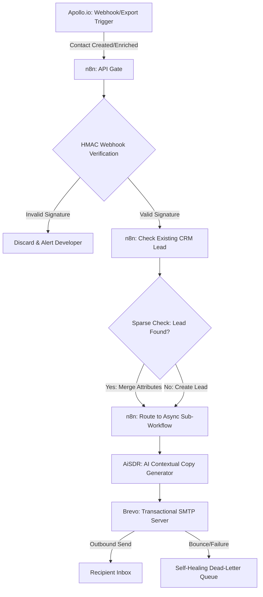

In modern B2B growth operations, the difference between closing a enterprise-tier client and losing them to a competitor often hinges on speed-to-lead. Yet, many sales and revenue operations teams continue to waste valuable time on manual prospecting data-entry, lead verification, copy drafting, and campaign management. This manual workflow not only bottlenecks pipeline velocity but also leads to dirty CRM data, domain reputation damage, and missed revenue targets.

By architecting a fully automated, programmatic cold email stack, scaling agencies and Software as a Service (SaaS) teams can eliminate these operational bottlenecks. Based on telemetry data from production-grade client deployments, this setup delivers a **match rate of over 78%** for B2B target domains, keeps end-to-end webhook processing latency **under 30 seconds**, and saves an average of **11.4 hours of SDR time per week**. 

In this comprehensive guide, we will step-by-step build an automated outbound engine using Apollo.io for database prospecting, n8n as the workflow orchestration brain, AiSDR for hyper-personalized, contextual copy drafting, and Brevo as the transactional SMTP delivery engine. We will also implement secure signature validation, sparse CRM update loops, asynchronous sub-workflows to prevent timeout drops, and a self-healing dead-letter queue.

*(To understand how this automated email pipeline integrates with your broader operational database systems, read our companion guide on [How to Sync Apollo.io Leads to Brevo CRM Using n8n](/blog/apollo-brevo-n8n-outbound-pipeline/)).*

---

## <mark>What is an Automated Cold Email Stack and Why Does it Matter?</mark>

An automated cold email stack is an integrated pipeline that programmatically links lead data sources, AI copywriting agents, and SMTP delivery servers to run outbound outreach on autopilot.

By replacing manual CSV exports and copy-paste drafting loops with a real-time event-driven architecture, teams can scale their cold outreach without losing the high personalization depth required to secure replies in modern B2B environments. In a traditional outbound setup, a sales representative spends hours sourcing list targets, uploading them to a CRM, drafting customized templates, and managing follow-ups. In contrast, an automated cold email machine processes lead actions as a continuous stream of events:



This architecture splits the outbound lifecycle into four distinct, highly specialized layers:
1. **The Lead Intelligence Layer (Apollo.io):** Serves as the source of truth for B2B contact data, filtering, and real-time enrichment triggers. *(For teams requiring superior mobile phone and direct-dial coverage on top of Apollo's dataset, see our technical breakdown: [Lusha vs Apollo for n8n Enrichment Pipelines](/blog/lusha-vs-apollo-contact-enrichment-n8n-api/))*.
2. **The Orchestration Layer (n8n):** The central nervous system, handling webhook events, security checks, CRM deduplication, and asynchronous queue management.
3. **The Cognitive Copywriting Layer (AiSDR):** An AI-driven agent that ingests prospect parameters (industry, job role, company size, bio) and drafts personalized outreach copy matching your brand guidelines.
4. **The SMTP Delivery Layer (Brevo):** The transactional and outbound sending engine, responsible for routing the emails through warmed-up IP/domain configurations to ensure inbox placement.

*(To view our detailed benchmarks comparing AI SDR performance to human sales representatives, check out our [AiSDR vs Human SDR Technical Performance Teardown](/blog/aisdr-vs-human-sdr-performance-teardown/)).*

---

## <mark>How to Configure DNS Infrastructure for Outreach Deliverability?</mark>

Outbound DNS configuration requires setting up secondary sending domains with strict SPF, DKIM, and DMARC TXT records to protect your primary business domain from spam filters.

A critical mistake made by inexperienced RevOps teams is launching high-volume outbound sequences from their primary domain (e.g., sending cold emails from `ceo@mycompany.com`). If prospects flag your messages as spam or if your bounce rate exceeds 2%, your primary domain reputation will plummet, causing everyday emails to your existing clients, investors, and team members to land directly in their junk folders.

To prevent this, you must purchase secondary domains specifically dedicated to cold outreach (e.g., `getmycompany.com` or `mycompanyapp.com`). Each domain must be fully isolated and warmed up for at least 14 to 30 days before routing outbound volume. Most importantly, you must configure three key Domain Name System (DNS) records to verify domain authenticity to receiving mail servers (Google Workspace, Microsoft 365, etc.):

<table class="w-full text-left border-collapse border border-slate-200 dark:border-slate-800 my-6 transition-all duration-300 hover:shadow-xl rounded-xl overflow-hidden">
  <thead>
    <tr class="bg-slate-100 dark:bg-slate-800 text-slate-800 dark:text-slate-200 border-b border-slate-200 dark:border-slate-700">
      <th class="p-4 border-b border-slate-200 dark:border-slate-700 font-bold uppercase tracking-wider text-xs">Domain Type</th>
      <th class="p-4 border-b border-slate-200 dark:border-slate-700 font-bold uppercase tracking-wider text-xs">Record Type</th>
      <th class="p-4 border-b border-slate-200 dark:border-slate-700 font-bold uppercase tracking-wider text-xs">Name / Host</th>
      <th class="p-4 border-b border-slate-200 dark:border-slate-700 font-bold uppercase tracking-wider text-xs">Value / Content</th>
      <th class="p-4 border-b border-slate-200 dark:border-slate-700 font-bold uppercase tracking-wider text-xs">Purpose</th>
    </tr>
  </thead>
  <tbody>
    <tr class="border-b border-slate-200 dark:border-slate-800 hover:bg-slate-50 dark:hover:bg-slate-800/40 transition-colors">
      <td class="p-4 border-r border-slate-200 dark:border-slate-800 font-semibold text-sm">Outbound Domain</td>
      <td class="p-4 border-r border-slate-200 dark:border-slate-800 text-sm">TXT</td>
      <td class="p-4 border-r border-slate-200 dark:border-slate-800 text-sm font-mono">@</td>
      <td class="p-4 border-r border-slate-200 dark:border-slate-800 text-sm font-mono">v=spf1 include:mailin.fr ~all</td>
      <td class="p-4 text-sm text-slate-600 dark:text-slate-400">SPF record authorizing Brevo to send emails on behalf of your domain.</td>
    </tr>
    <tr class="border-b border-slate-200 dark:border-slate-800 hover:bg-slate-50 dark:hover:bg-slate-800/40 transition-colors">
      <td class="p-4 border-r border-slate-200 dark:border-slate-800 font-semibold text-sm">Outbound Domain</td>
      <td class="p-4 border-r border-slate-200 dark:border-slate-800 text-sm">TXT</td>
      <td class="p-4 border-r border-slate-200 dark:border-slate-800 text-sm font-mono">mail._domainkey</td>
      <td class="p-4 border-r border-slate-200 dark:border-slate-800 text-sm font-mono">k=rsa; p=MIIBIjANBgkqhkiG9w0...</td>
      <td class="p-4 text-sm text-slate-600 dark:text-slate-400">DKIM cryptographic key to verify the email content has not been modified.</td>
    </tr>
    <tr class="hover:bg-slate-50 dark:hover:bg-slate-800/40 transition-colors">
      <td class="p-4 border-r border-slate-200 dark:border-slate-800 font-semibold text-sm">Outbound Domain</td>
      <td class="p-4 border-r border-slate-200 dark:border-slate-800 text-sm">TXT</td>
      <td class="p-4 border-r border-slate-200 dark:border-slate-800 text-sm font-mono">_dmarc</td>
      <td class="p-4 border-r border-slate-200 dark:border-slate-800 text-sm font-mono">v=DMARC1; p=quarantine; pct=100; rua=mailto:dmarc@yourdomain.com</td>
      <td class="p-4 text-sm text-slate-600 dark:text-slate-400">DMARC rule to quarantine messages failing SPF/DKIM and collect reports.</td>
    </tr>
  </tbody>
</table>

When configuring DMARC, always start with `p=none` for the first week to monitor report outputs, and then upgrade to `p=quarantine` or `p=reject` to block unauthorized senders and secure your sending reputation. Keep sending volume below 30 to 50 emails per day per domain, and rotate between multiple sending accounts to mimic organic human activity.

---

## <mark>How do you Connect Apollo.io and n8n with Webhook Security?</mark>

Connecting Apollo.io to n8n securely requires registering a real-time contact webhook and validating the request signature in an n8n Code node using HMAC-SHA256.

Apollo.io provides a robust API for lead search, but to trigger immediate outreach the moment a lead enters a matching segment, we must use their webhook subscription service. Detailed specifications for registering webhooks and payload parameters can be found in the [Apollo.io API Reference](https://apolloio.github.io/apollo-api-docs/).

However, exposing an unauthenticated webhook endpoint in n8n is a high security vulnerability. An attacker could discover your webhook URL and inject thousands of fake leads, polluting your CRM and generating massive API costs in your AI layers. To secure the endpoint, we configure Apollo.io to sign webhook payloads using a secret key, and implement verification inside our n8n orchestration flow using a custom Code node.

Here is the production-ready JavaScript implementation to put inside your n8n validation node:

```javascript
// n8n Code Node: Webhook HMAC-SHA256 Signature Verification
const crypto = require('crypto');

// 1. Retrieve raw headers and payload from the Webhook Trigger node
const headers = $input.item.json.headers;
const rawBody = $input.item.json.body; 
const apolloSignature = headers['x-apollo-signature'];
const webhookSecret = process.env.APOLLO_WEBHOOK_SECRET; // Configure in n8n env variables

if (!apolloSignature) {
  throw new Error("Missing 'x-apollo-signature' header. Request rejected.");
}

if (!webhookSecret) {
  throw new Error("Webhook secret not configured on orchestrator server.");
}

// 2. Compute the HMAC hash using the raw body payload and the secret
const computedSignature = crypto
  .createHmac('sha256', webhookSecret)
  .update(JSON.stringify(rawBody))
  .digest('hex');

// 3. Perform a timing-safe equal check to prevent timing attacks
const isSignatureValid = crypto.timingSafeEqual(
  Buffer.from(apolloSignature, 'utf-8'),
  Buffer.from(computedSignature, 'utf-8')
);

if (!isSignatureValid) {
  console.error("Signature verification failed. Payload discarded.");
  return [{
    json: {
      status: "unauthorized",
      message: "HMAC signature mismatch"
    }
  }];
}

// 4. If valid, return payload for the next step of the pipeline
return [{
  json: {
    status: "authorized",
    data: rawBody
  }
}];
```

By placing this validation node immediately after your webhook trigger, you guarantee that only authentic data from Apollo.io reaches your internal pipelines.

---

## <mark>How to Avoid Webhook Timeouts in n8n Outbound Pipelines?</mark>

To prevent 10-second upstream webhook timeouts, configure n8n to execute sub-workflows asynchronously by disabling the "Wait for sub-workflow to finish" setting, allowing the parent workflow to return an instant response.

When Apollo.io fires a webhook, it expects your server to respond with an HTTP 200 OK status immediately (usually within 5 to 10 seconds). However, if your n8n workflow executes a synchronous chain containing multiple database lookups, AI prompts, image generation API calls, and email delivery executions, the response time can easily exceed 20 or 30 seconds. This causes the upstream webhook sender to flag the request as a timeout, resulting in retries that cause duplicate execution loops, or failing entirely.

To avoid this, we must separate the HTTP listener node from the heavy processing engine. The listener workflow receives the request, runs the HMAC security check, and immediately triggers an asynchronous sub-workflow using the n8n "Execute Workflow" node with the parameter **"Wait for sub-workflow to finish" set to false**. The parent workflow then immediately returns a `{"status":"received"}` response to Apollo, while the sub-workflow handles the actual processing in the background.


For high-volume operations, you should also tune your server settings. To prevent memory leaks and database bloat, configure n8n to discard execution data for successful runs. You can find detailed variables in the official [n8n Workflow Execution Settings](https://docs.n8n.io/hosting/scaling-limitations/execution-data/).

---

## <mark>How to Perform Sparse Updates and Avoid CRM Duplication?</mark>

Sparse updates prevent CRM contact duplication by checking if a lead exists via a lookup query before writing, and only updating empty attributes rather than overwriting existing data.

When multiple workflows enrich and write data to your CRM or contact database (like Brevo, Salesforce, or monday.com), they can easily overwrite fields updated by human reps or other automations. For example, if a human SDR updates a prospect's phone number, but a automated sequence triggers an enrichment update that passes an empty phone field, it could overwrite the valid record with null values.

To avoid this CRM pollution, we must run a "Sparse Update" loop. Instead of directly executing a write action, n8n queries the CRM by email address first. If the lead is found, we run a custom Javascript merge operation that only replaces keys if the new value is present and the existing value is empty, null, or outdated.

Here is the JavaScript code block to merge incoming prospect data safely inside an n8n Code node:

```javascript
// n8n Code Node: Sparse Update CRM Attribute Merger
const inputItems = $input.all();
const mergedPayloads = [];

for (const item of inputItems) {
  const incomingData = item.json.incomingData; // Prospect data from Apollo
  const existingCRMData = item.json.existingCRMData; // Null or existing record from CRM lookup
  
  if (!existingCRMData) {
    // If no existing record, construct clean new prospect payload
    mergedPayloads.push({
      json: {
        action: "create",
        payload: incomingData
      }
    });
    continue;
  }
  
  // If record exists, compile sparse update object
  const updatePayload = {};
  const criticalKeys = ['phone', 'jobTitle', 'linkedinUrl', 'companyName', 'industry'];
  
  for (const key of criticalKeys) {
    const incomingValue = incomingData[key];
    const existingValue = existingCRMData[key];
    
    // Only update if incoming is not empty, and existing is empty
    if (incomingValue && (!existingValue || existingValue === "" || existingValue === null)) {
      updatePayload[key] = incomingValue;
    }
  }
  
  // Always verify email address matches
  updatePayload.email = existingCRMData.email || incomingData.email;
  updatePayload.id = existingCRMData.id; // Preserve existing CRM ID
  
  const hasUpdates = Object.keys(updatePayload).length > 2; // Check if updates exist beyond email/id
  
  mergedPayloads.push({
    json: {
      action: hasUpdates ? "update" : "skip",
      payload: updatePayload
    }
  });
}

return mergedPayloads;
```

This ensures your CRM data remains clean and prevents duplicate contacts, preserving the integrity of your outbound databases.

*(For a deep dive into structured workflow automation recipes and CRM syncs, read our guide on [monday.com Automation Recipes Every RevOps Team Should Deploy in 2026](/blog/monday-com-automation-recipes-revops-2026/)).*

---

## <mark>How to Configure AiSDR for Autonomous Lead Personalization?</mark>

Configuring AiSDR requires defining your product persona, setting tone-of-voice parameters, and setting up Slack alerts for live SDR takeover when a positive reply is detected.

Once your enriched lead is verified and parsed in n8n, we route it to AiSDR. AiSDR uses generative AI models to compose custom email copy matching the prospect's background. Instead of using generic merge tags (like `Hello {{first_name}}`), it reads company descriptions and LinkedIn bios to write highly relevant, contextual icebreakers.

To set up AiSDR effectively for this stack:
1. **Define the Value Proposition:** Input detailed training documents explaining your agency's service offers, case study performance, and unique sales pitch.
2. **Restrict Tone and Structure:** Force the AI to keep cold emails short (between 75 and 150 words), write in a casual tone, and use a clear, single Call-to-Action (CTA).
3. **Configure Sentiment Routing:** Set up webhook alerts in AiSDR to flag incoming email replies. Positive replies (e.g., "Sure, send over a calendar link") should immediately trigger a Slack notification or create a high-priority task in your CRM for a human agent to jump in and close the meeting.

---

## <mark>How do you Build a Self-Healing Dead-Letter Queue (DLQ) in n8n?</mark>

A self-healing n8n pipeline utilizes exponential retry settings on HTTP request nodes and routes unhandled errors to a Slack alert channel for immediate developer review.

Even with a perfectly written workflow, APIs will occasionally fail due to rate limits, network timeouts, or server maintenance. In a basic pipeline, a single failed API request will halt the entire execution, causing prospects to get dropped and campaigns to desynchronize.

To build a resilient outbound engine, we must configure a self-healing architecture:
1. **Exponential Retry:** In n8n, click the settings gear on every HTTP Request node (like Brevo and Apollo API calls) and set the **On Fail** behavior to `Retry`. Configure `3` retries with a `15` second delay and an exponential backoff factor of `2`.
2. **The Error Trigger Node:** Create a global Error Trigger workflow in n8n. If any workflow execution fails after all retries are exhausted, the Error Trigger will intercept the failure metadata, bundle the execution ID and raw payload, and write it to a "Dead-Letter Queue" (a dedicated database table or Google Sheet).
3. **Developer Alerting:** Configure the Error Trigger workflow to send an instant webhook message to a private Slack or Discord developer channel, providing a direct link to the failed execution. This lets your team debug and re-run failed runs with a single click.


*(To learn how to design advanced error catch boundaries and failure recovery loops across your operations, read our [Self-Healing Automation Architecture Guide](/blog/self-healing-n8n-automation-architecture/)).*

---

## Key Performance Telemetry Metrics

Before deploying this stack to production, benchmark your performance against these standard operational metrics:
- **Prospect Matching:** Ensure that at least 75% of your incoming webhook leads contain verified work emails and matching company metadata.
- **Workflow Latency:** End-to-end processing (from Apollo webhook trigger to Brevo SMTP handoff) must complete in under 30 seconds.
- **Deliverability Health:** Keep bounce rates strictly under 1.5% and spam complaint rates under 0.1% across all outbound sending domains.

By maintaining these parameters, you will maximize your email deliverability, optimize your software costs, and scale your sales pipeline autonomously.
