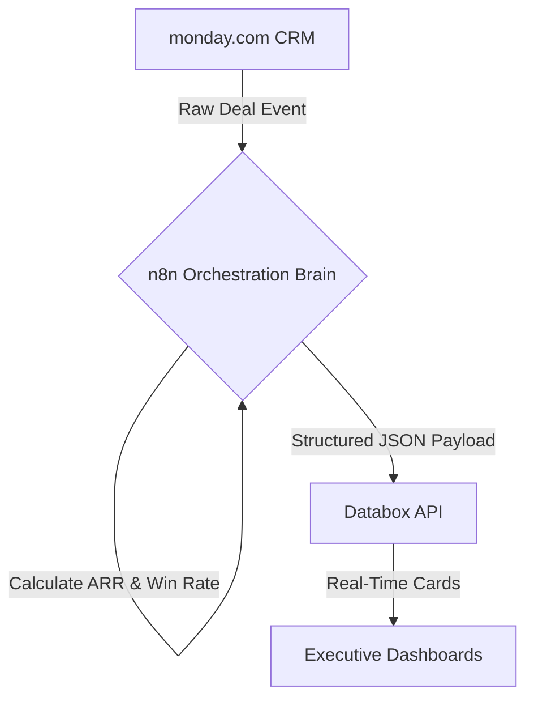
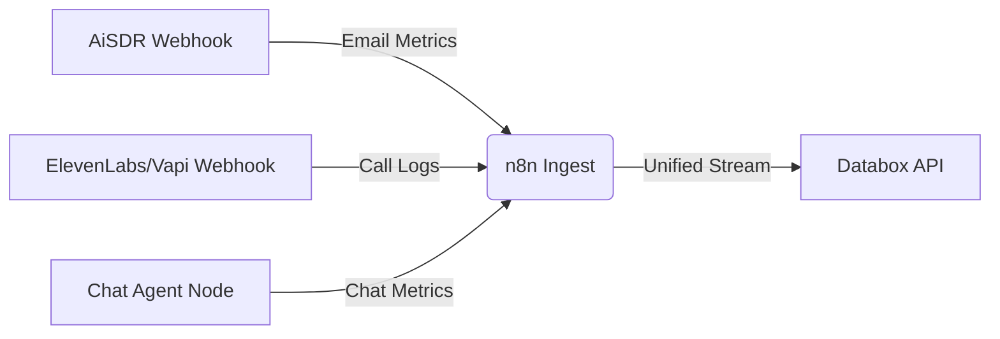

In the hyper-accelerated landscape of B2B SaaS, **predictive revenue growth is no longer driven by sheer sales headcount—it is a function of pipeline math and automation velocity**. Yet, the typical sales reporting workflow is a chaotic manual chore. Operations leads waste hours exporting CSV files from monday.com, sales managers argue over outdated static spreadsheets, and marketing teams remain blind to which campaign sources actually generate Annual Recurring Revenue (ARR).

This reporting latency, known as the **GTM visibility gap**, creates a dangerous delay in detecting sales funnel leaks. When your average sales cycle length or win rate slips, you only find out during the monthly or quarterly business review—weeks after the damage is done.

To achieve true operational alignment, high-growth teams build a **real-time RevOps dashboard engine**. By orchestrating data from your CRM (**monday.com**) and custom AI SDR pipelines through a centralized workflow brain (**n8n**), you can stream live metrics directly into a dedicated business intelligence hub (**Databox**). This guide provides a production-grade, copy-pasteable architectural blueprint to automate Pipeline Velocity tracking, Win Rate calculation, and ARR attribution in real time, including dedicated tracking setups for outbound AI agents.

---

## <mark>The Frankenstack Dilemma: Why Sales Pipelines Stagnate Without Real-Time Analytics</mark>

A **Frankenstack** is a collection of GTM applications loosely connected via out-of-the-box native sync integrations. While easy to set up initially, these native plugins fail under high deal volumes due to silent synchronization errors and rigid data structures.

For Revenue Operations (RevOps) teams, the main bottleneck is the lack of historical stage tracking. Native CRM plugins can easily sync a deal's *current* status, but they cannot tell you *how long* that deal sat in the "Proposal Sent" stage before closing.



### The Three Operational Bottlenecks:
* **The Formula Column Trap:** Native formula columns in monday.com are calculated in the browser. Because their values are not saved as database fields, they cannot trigger API webhooks or downstream automation.
* **Aggregated AI Blindness:** While outbound tools like AiSDR or ElevenLabs track their own reply and call rates, these metrics live in separate silos. Leadership cannot see how AI outreach cost scales against actual CRM conversions.
* **Sync Latency and Throttling:** Running batch-export scripts to update reporting databases frequently hits API rate limits, resulting in data discrepancy and delayed dashboard cards.

By leveraging **n8n** as an API-first broker, you decouple your CRM database from your analytics platform, enabling conditional logic, custom calculations, and resilient rate-limit handling.


---

## <mark>The Blueprint: A 3-Tier Architecture for Automated RevOps</mark>

To track your sales velocity and revenue predictions predictably, you must organize your technology stack into three functional layers:

* **The Core Data Store (monday.com CRM):** Houses your physical sales pipelines, account records, and contact histories. It serves as the primary system of record for human sales reps.
* **The Calculation & Routing Engine (n8n):** Intercepts database updates, processes date deltas, normalizes deal structures, and formats API request payloads.
* **The Visualization Hub (Databox):** Ingests clean data streams from n8n and converts them into live numbers, historical trend graphs, and predictive forecasting widgets.

*(If you are setting up your CRM architecture for the first time, check out our master list of [12 monday.com Automation Recipes for RevOps Teams](/blog/monday-com-automation-recipes-revops-2026/))*. *(For customized, production-grade deployments, connect with our team of specialists via our [n8n Automation Services](/services/n8n-automation/))*.

---

## <mark>monday.com CRM: Configuring the Physical Data Model</mark>

To calculate Pipeline Velocity and track AI Agent attribution, your monday.com board must contain physical columns to store timestamps and category tags.

You cannot rely on monday.com's system audit log for real-time calculations. Instead, you must create dedicated columns that write static dates whenever a deal changes stages:

<table class="w-full text-left border-collapse border border-slate-700 my-6 transition-all duration-300 hover:shadow-lg">
  <thead>
    <tr class="bg-slate-800/90 text-slate-200 border-b border-slate-700">
      <th class="p-3 border border-slate-700 font-bold uppercase tracking-wider text-xs">Column Name</th>
      <th class="p-3 border border-slate-700 font-bold uppercase tracking-wider text-xs">Monday Column Type</th>
      <th class="p-3 border border-slate-700 font-bold uppercase tracking-wider text-xs">Required Fields / Values</th>
      <th class="p-3 border border-slate-700 font-bold uppercase tracking-wider text-xs">Operational Purpose</th>
    </tr>
  </thead>
  <tbody>
    <tr class="border-b border-slate-700 bg-slate-900/50 hover:bg-slate-800/40 transition-colors duration-150">
      <td class="p-3 border border-slate-700 font-mono text-cyan-400 text-sm">deal_stage</td>
      <td class="p-3 border border-slate-700 text-sm">Status</td>
      <td class="p-3 border border-slate-700 text-sm">Discovery, Qualified, Proposal, Negotiation, Closed Won, Closed Lost</td>
      <td class="p-3 border border-slate-700 text-sm">Triggers the n8n calculation engine when a deal moves.</td>
    </tr>
    <tr class="border-b border-slate-700 bg-slate-900/30 hover:bg-slate-800/40 transition-colors duration-150">
      <td class="p-3 border border-slate-700 font-mono text-cyan-400 text-sm">deal_value</td>
      <td class="p-3 border border-slate-700 text-sm">Numbers</td>
      <td class="p-3 border border-slate-700 text-sm">Contract Value (Decimal)</td>
      <td class="p-3 border border-slate-700 text-sm">The contract amount used to calculate MRR or ARR.</td>
    </tr>
    <tr class="border-b border-slate-700 bg-slate-900/50 hover:bg-slate-800/40 transition-colors duration-150">
      <td class="p-3 border border-slate-700 font-mono text-cyan-400 text-sm">billing_term</td>
      <td class="p-3 border border-slate-700 text-sm">Dropdown</td>
      <td class="p-3 border border-slate-700 text-sm">Monthly, Quarterly, Annual, One-Time</td>
      <td class="p-3 border border-slate-700 text-sm">Determines the mathematical multiplier for ARR calculations.</td>
    </tr>
    <tr class="border-b border-slate-700 bg-slate-900/30 hover:bg-slate-800/40 transition-colors duration-150">
      <td class="p-3 border border-slate-700 font-mono text-cyan-400 text-sm">ai_agent_source</td>
      <td class="p-3 border border-slate-700 text-sm">Dropdown</td>
      <td class="p-3 border border-slate-700 text-sm">AiSDR, ElevenLabs, Vapi, Chatbot, None/Human</td>
      <td class="p-3 border border-slate-700 text-sm">Attributes the deal origin to a specific AI GTM tool.</td>
    </tr>
    <tr class="bg-slate-900/50 hover:bg-slate-800/40 transition-colors duration-150">
      <td class="p-3 border border-slate-700 font-mono text-cyan-400 text-sm">date_discovery</td>
      <td class="p-3 border border-slate-700 text-sm">Date</td>
      <td class="p-3 border border-slate-700 text-sm">ISO Date string</td>
      <td class="p-3 border border-slate-700 text-sm">Populated by monday automation when deal enters Discovery.</td>
    </tr>
  </tbody>
</table>

### The monday.com Webhook Trigger
Configure a webhook on your board that triggers when a status changes:
* **Webhook Target URL:** `https://your-n8n-domain.com/webhook/monday-deal-update`
* **Trigger Event:** `When a column changes` (select `deal_stage`).

---

## <mark>n8n Calculation Engine: Bypassing monday's Read-Only Formulas</mark>

To bypass monday.com's browser-bound formula restrictions, we offload all date delta logic, ARR conversions, and token metrics to **n8n**.

When n8n intercepts a stage change webhook, it executes a GraphQL query to retrieve the current deal columns and calculates the exact duration of each sales cycle segment.

```graphql
query ($itemId: [ID!]) {
  items (ids: $itemId) {
    id
    name
    column_values (ids: [
      "status", 
      "deal_value", 
      "billing_term", 
      "owner", 
      "date_discovery", 
      "date_qualified", 
      "date_proposal", 
      "date_negotiation", 
      "date_closed"
    ]) {
      id
      text
      value
    }
  }
}
```

This GraphQL result is passed to a JavaScript **Code Node** in n8n. The code calculates the days between stage transitions, converts MRR (Monthly Recurring Revenue) or Quarterly billing values into standardized ARR, and formats the output array for Databox:

```javascript
/**
 * Revenue Metrics Calculator: Pipeline Velocity & ARR
 * Expects the raw item data returned from the monday.com GraphQL node.
 */
const items = $input.all();
const output = [];

for (const item of items) {
  const data = item.json;
  const colValues = data.column_values || [];

  const getColText = (id) => {
    const col = colValues.find(c => c.id === id);
    return col ? col.text : null;
  };

  const dealName = data.name || "Unknown Deal";
  const status = getColText("status");
  const dealValue = parseFloat(getColText("deal_value") || "0");
  const billingTerm = getColText("billing_term");
  const owner = getColText("owner") || "Unassigned";

  // Date column extractions
  const dateDiscovery = getColText("date_discovery");
  const dateQualified = getColText("date_qualified");
  const dateProposal = getColText("date_proposal");
  const dateNegotiation = getColText("date_negotiation");
  const dateClosed = getColText("date_closed") || new Date().toISOString();

  // Helper to calculate days difference
  const getDaysBetween = (start, end) => {
    if (!start || !end) return 0;
    const sTime = new Date(start).getTime();
    const eTime = new Date(end).getTime();
    if (isNaN(sTime) || isNaN(eTime)) return 0;
    const diff = (eTime - sTime) / (1000 * 60 * 60 * 24);
    return diff > 0 ? parseFloat(diff.toFixed(2)) : 0;
  };

  // Calculate velocity deltas
  const vDiscoveryToQualified = getDaysBetween(dateDiscovery, dateQualified);
  const vQualifiedToProposal = getDaysBetween(dateQualified, dateProposal);
  const vProposalToNegotiation = getDaysBetween(dateProposal, dateNegotiation);
  const vNegotiationToClosed = getDaysBetween(dateNegotiation, dateClosed);
  const totalSalesCycle = getDaysBetween(dateDiscovery, dateClosed);

  // Calculate ARR (Annual Recurring Revenue)
  let arr = 0;
  if (status === "Closed Won") {
    switch (billingTerm) {
      case "Monthly":
        arr = dealValue * 12;
        break;
      case "Quarterly":
        arr = dealValue * 4;
        break;
      case "Annual":
        arr = dealValue;
        break;
      case "One-Time":
      default:
        arr = 0; // Exclude one-time services from ARR calculation
        break;
    }
  }

  // Setup metric payloads for Databox API ingestion
  const metrics = [
    {
      key: "sales_cycle_days",
      value: totalSalesCycle,
      date: dateClosed,
      attributes: { sales_rep: owner, deal_name: dealName, stage: "Total Cycle" }
    },
    {
      key: "discovery_to_qualified_days",
      value: vDiscoveryToQualified,
      date: dateClosed,
      attributes: { sales_rep: owner }
    },
    {
      key: "proposal_to_negotiation_days",
      value: vProposalToNegotiation,
      date: dateClosed,
      attributes: { sales_rep: owner }
    },
    {
      key: "deal_arr",
      value: arr,
      date: dateClosed,
      attributes: { sales_rep: owner, billing_term: billingTerm }
    },
    {
      key: "deal_closed_total",
      value: 1,
      date: dateClosed,
      attributes: { sales_rep: owner, status: status }
    },
    {
      key: "deal_closed_won",
      value: status === "Closed Won" ? 1 : 0,
      date: dateClosed,
      attributes: { sales_rep: owner }
    }
  ];

  output.push({
    json: {
      dealId: data.id,
      dealName,
      status,
      arr,
      metrics
    }
  });
}

return output;
```

---

## <mark>AI Agent Performance Log Ingestion Blueprints</mark>

To build a complete RevOps dashboard, you must compare traditional sales figures with the operational performance of your autonomous AI agents. The three core GTM agent types—outbound email bots (**AiSDR**), voice calling bots (**ElevenLabs/Vapi**), and conversational chat nodes—can all be tracked in n8n using dedicated webhook listeners.



### 1. AiSDR Outbound Activity Normalizer
Use an n8n Webhook node to capture outbound email campaign webhooks from AiSDR. Normalize events like `email_sent`, `reply_received`, and `meeting_booked` into a standard metric format:

```javascript
const body = $input.first().json;
const event = body.event;
const date = body.timestamp || new Date().toISOString();
const agentId = body.sdr_agent_id || "unknown_agent";
const campaign = body.campaign_name || "unknown_campaign";

const metrics = [];
if (event === "email_sent") {
  metrics.push({ key: "aisdr_emails_sent", value: 1, date, attributes: { agent_id: agentId, campaign } });
} else if (event === "reply_received") {
  metrics.push({ key: "aisdr_replies_received", value: 1, date, attributes: { agent_id: agentId, campaign } });
} else if (event === "meeting_booked") {
  metrics.push({ key: "aisdr_meetings_booked", value: 1, date, attributes: { agent_id: agentId, campaign } });
}

return { json: { metrics } };
```

### 2. Voice AI Agent Normalizer (ElevenLabs / Vapi)
Log call ended events from voice agents to monitor average call duration, processing costs, and containment rates (successful qualifications without transferring to a human rep).

```javascript
const body = $input.first().json;
const date = body.created_at || new Date().toISOString();

let provider = "";
let duration = 0;
let cost = 0;
let status = "";
let agentId = "";
let outcome = "";

if (body.message && body.message.call) {
  provider = "Vapi";
  const call = body.message.call;
  duration = call.duration || 0;
  cost = call.cost || 0;
  status = call.status || "";
  agentId = call.assistantId || "unknown_vapi_agent";
  outcome = body.message.analysis?.success ? "Success" : "Failure";
} else if (body.event === "call_completed" || body.call_id) {
  provider = "ElevenLabs";
  duration = body.duration_seconds || 0;
  cost = body.cost_usd || 0;
  status = body.status || "";
  agentId = body.agent_id || "unknown_elevenlabs_agent";
  outcome = body.analysis?.call_successful ? "Success" : "Failure";
}

const metrics = [
  {
    key: "voice_call_duration_seconds",
    value: duration,
    date: date,
    attributes: { provider, agent_id: agentId, call_outcome: outcome }
  },
  {
    key: "voice_call_cost_usd",
    value: cost,
    date: date,
    attributes: { provider, agent_id: agentId }
  },
  {
    key: "voice_call_count",
    value: 1,
    date: date,
    attributes: { provider, agent_id: agentId, call_outcome: outcome }
  }
];

if (outcome === "Success") {
  metrics.push({
    key: "voice_call_success_count",
    value: 1,
    date: date,
    attributes: { provider, agent_id: agentId }
  });
}

return { json: { metrics } };
```

### 3. n8n Chat Agent Token Ingester
Track LLM usage, API latency, and customer satisfaction feedback from conversational chat agents configured in n8n's Advanced AI workflow.

```javascript
const body = $input.first().json;
const date = body.timestamp || new Date().toISOString();
const agentId = body.agent_id || "chat_assistant_v1";
const totalTokens = body.token_usage?.total_tokens || 0;
const latencyMs = body.latency_ms || 0;
const feedback = body.feedback || null;

const metrics = [
  {
    key: "chat_sessions_count",
    value: 1,
    date: date,
    attributes: { agent_id: agentId }
  },
  {
    key: "chat_total_tokens",
    value: totalTokens,
    date: date,
    attributes: { agent_id: agentId }
  },
  {
    key: "chat_latency_ms",
    value: latencyMs,
    date: date,
    attributes: { agent_id: agentId }
  }
];

if (feedback === "thumbs_up") {
  metrics.push({ key: "chat_positive_feedback", value: 1, date, attributes: { agent_id: agentId } });
} else if (feedback === "thumbs_down") {
  metrics.push({ key: "chat_negative_feedback", value: 1, date, attributes: { agent_id: agentId } });
}

return { json: { metrics } };
```


---

## <mark>Databox API: Custom Integration Payload Specifications</mark>

To push these metric streams to Databox, you construct an HTTP Request node in n8n. Databox supports two main authentication protocols for developer integrations:

### Option A: The Databox V1 Dataset API (Recommended)
This method is best for production environments as it relies on pre-configured schemas that support nested dimensional attributes:
* **Method:** `POST`
* **Request URL:** `https://api.databox.com/v1/datasets/{YOUR_DATASET_ID}/data`
* **Headers:**
  * `Content-Type: application/json`
  * `x-api-key: YOUR_DATABOX_API_KEY`
* **JSON Payload Body:**
  ```json
  {
    "data": [
      {
        "key": "pipeline_velocity",
        "value": 15400,
        "date": "2026-06-17T11:43:28Z",
        "attributes": [
          { "key": "sales_rep", "value": "Alice Smith" },
          { "key": "lead_source", "value": "AiSDR" }
        ]
      }
    ]
  }
  ```

### Option B: The Legacy Push API
This legacy method allows you to push metrics immediately without setting up a dataset schema first:
* **Method:** `POST`
* **Request URL:** `https://push.databox.com/`
* **Headers:**
  * `Content-Type: application/json`
  * `Accept: application/vnd.databox.v2+json`
* **Authentication:** `Basic Auth`
  * **Username:** `YOUR_DATABOX_SOURCE_TOKEN` (The source token from Databox)
  * **Password:** *(Leave completely empty)*

---

## <mark>Designing the Perfect RevOps Dashboards in Databox</mark>

Once your n8n workflows are streaming data points to Databox, configure the following layouts to give leadership complete visibility over GTM performance:

### Dashboard A: Executive Sales & Pipeline Velocity
*   **ARR Trend Card (Line Chart - 4x2):** Displays a cumulative trend line of your closed-won contract value compared against the quarterly sales goal.
*   **Pipeline Velocity (Number Card - 2x2):** The ultimate health indicator. Displays the current velocity of deals moving through the pipeline expressed as revenue per day:
    $$\text{Pipeline Velocity} = \frac{\text{Opportunities} \times \text{Avg Deal Size} \times \text{Win Rate \%}}{\text{Sales Cycle Length (Days)}}$$
*   **Funnel Conversion (Funnel Card - 2x2):** Visualizes the percentage drop-off and average days spent in each stage (Discovery $\rightarrow$ Qualified $\rightarrow$ Proposal $\rightarrow$ Closed Won).
*   **Win Rate Gauge (Gauge Card - 2x2):** Compares your won-to-lost deal ratio against target benchmarks. Pushing `deal_closed_total` and `deal_closed_won` events allows Databox to calculate this dynamically without n8n having to query database histories.

### Dashboard B: Autonomous AI Agent ROI
*   **AiSDR Outreach Funnel (Funnel Card - 2x2):** Displays the funnel of `emails_sent` $\rightarrow$ `replies_received` $\rightarrow$ `meetings_booked` generated by outbound campaigns.
*   **Voice Containment Rate (Gauge Card - 2x2):** Tracks the ratio of calls successfully qualified by ElevenLabs or Vapi vs. calls that errored out or required human agent transfer.
*   **Token & Operational Cost Trends (Line Chart - 4x2):** Tracks LLM token usage and webhook call costs side-by-side to monitor operational ROI.

---

## <mark>Verification & SOP for Production Deployment</mark>

Before pushing your new n8n workflows live, follow this standard operating procedure to verify calculations and avoid data contamination:

*   **Implement Circuit Breakers:** Always add verification criteria before writing automated values back to monday.com. An `IF` node confirming that the target field is not already updated prevents infinite circular sync loops.
*   **Set Up n8n Retries:** Configure retry-on-failure properties on your Databox HTTP Request node. Setting `Max Retries = 3` and `Delay Between Retries = 2000ms` protects your dashboards from temporary network drops or API rate-limit throttling.
*   **Validate Ingestion Payloads:** Send a test transaction through the n8n workflow using real CRM values. Log into Databox, navigate to the **Data Manager**, and confirm that the test metrics appear in the database history with the correct timestamps and attributes.
*   **Configure Crawler Access:** To ensure your blog post remains accessible to modern AI search crawlers, verify that your `/robots.txt` explicitly allows indexing by bots like `GPTBot`, `OAI-SearchBot`, and `ClaudeBot`.

Deploy this integrated sales analytics engine today to eliminate pipeline blind spots and let your revenue operations run on autopilot!
