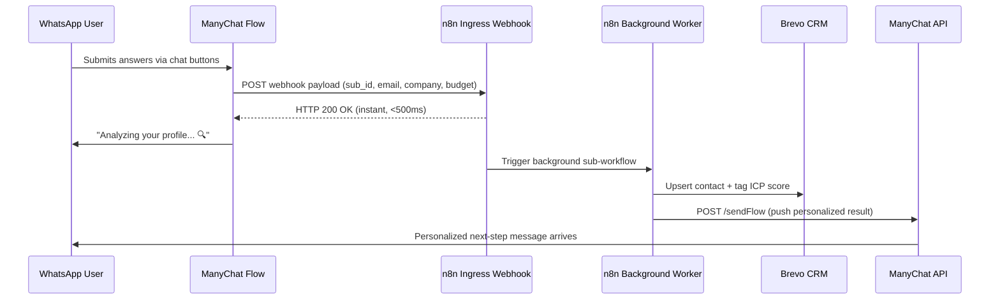

The best B2B lead form you ever built is losing to a WhatsApp conversation. According to Meta's own platform data, WhatsApp messages see **98% open rates** versus 21% for email. For B2B agencies managing high-velocity outbound campaigns, that delta is the difference between a full pipeline and a wasted ad budget.

But deploying WhatsApp lead capture at agency scale — across multiple clients, with real CRM sync, AI qualification, and human handoff — requires more than a ManyChat account and a few automation blocks. It requires a production-grade architecture that addresses the **10-second timeout trap**, Meta's 24-hour compliance window, multi-tenant data isolation, and graceful bot-to-human escalation.

This is the playbook for agencies building that system — from zero to a live, fully automated WhatsApp lead capture engine using **ManyChat**, **n8n**, and **Brevo CRM**.

> **Who this is for:** Automation agency owners, RevOps engineers, and growth operators deploying WhatsApp funnels for B2B clients. If you need this built for you, our team handles [end-to-end n8n automation implementation](/services/n8n-automation/).

---

## <mark>Why WhatsApp Beats Web Forms for B2B Lead Capture</mark>

Why do WhatsApp-based lead capture flows outperform web forms for B2B?

WhatsApp delivers instant, high-context, two-way conversations where the prospect already is — on their phone — eliminating the friction of a new browser tab, login wall, or multi-field form. Three structural advantages make it superior for B2B:

1. **Implicit Trust Signal:** Prospects opening a WhatsApp conversation have already demonstrated higher intent than a casual form-fill. They chose to engage, which pre-qualifies them behaviorally.
2. **Conversational Data Richness:** By asking 4–6 structured qualification questions via chat buttons, you collect the same ICP data (company size, budget, decision timeline) as a form — but with 3–5x higher completion rates because it feels like a conversation, not an interrogation.
3. **Persistent Contact Channel:** Unlike email addresses that get spam-filtered, a WhatsApp conversation creates a persistent, direct line to the prospect's phone for future nurture sequences and broadcast campaigns — **with their explicit consent**.

*(See how we structure a complete inbound RevOps engine from first touch to CRM attribution in our [RevOps Automation Stack guide](/blog/revops-automation-stack-saas-2026/))*

---

## <mark>The 10-Second Timeout Trap — And How to Escape It</mark>

How do you solve ManyChat's 10-second webhook timeout in production?

ManyChat enforces a strict 10-second response window on all External Request (webhook) actions. If your downstream logic — AI lead scoring, CRM profile enrichment via Apollo.io, or Brevo contact upsert — takes longer than 10 seconds, ManyChat terminates the connection. The chat flow freezes. The lead gets no response. The conversation dies silently.

This is the **single most common production failure** in ManyChat integrations, and the one competitors never address.

The fix is a **decoupled asynchronous architecture** that separates the webhook handshake from the background processing engine using n8n.



### Stage 1: The Ingress Webhook (Immediate Handshake)

In your n8n workflow, add a **Webhook Trigger Node** with `responseMode` set to `onReceived`. This forces n8n to return an HTTP 200 immediately upon request receipt — before any downstream processing begins:

```json
{
  "name": "ManyChat WhatsApp Ingress",
  "parameters": {
    "httpMethod": "POST",
    "path": "manychat-wa-lead-ingress",
    "responseMode": "onReceived",
    "responseData": "firstEntryJson"
  }
}
```

After the Webhook node, immediately add a **Respond to Webhook** node returning `{ "status": "received" }`. This completes ManyChat's request. Everything after this node runs asynchronously.

### Stage 2: Background Processing Sub-Workflow

Trigger a **Call n8n Workflow** node (or use an Execute Workflow node) pointing to a separate background worker workflow. This sub-workflow handles:
- AI intent classification (Hot / Warm / Cold)
- Brevo CRM contact upsert
- Slack notification for Hot leads
- ManyChat API callback with the personalized message

---

## <mark>ManyChat WhatsApp Setup: Entry Points, Flows, and Compliance</mark>

What entry points should you use for B2B WhatsApp lead capture in ManyChat?

Use **Click-to-WhatsApp ads** (Meta Ads Manager → "WhatsApp" objective) as your primary entry point — not keyword triggers. Keyword triggers fire on any incoming message matching that word, which causes unintended flow triggers from existing contacts. Click-to-WhatsApp ads pre-fill a conversation opener and guarantee a clean, tracked entry into your qualification flow.

### The B2B Qualification Flow Structure

Structure your ManyChat WhatsApp flow as a 5-question conversational gate. Use **Quick Reply Buttons** (not open text fields) for all categorical data to ensure clean, parseable values:

<table class="w-full text-left border-collapse border border-slate-700 my-6">
  <thead>
    <tr class="bg-slate-800/90 text-slate-200 border-b border-slate-700">
      <th class="p-3 border border-slate-700 text-xs font-bold uppercase tracking-wider">Step</th>
      <th class="p-3 border border-slate-700 text-xs font-bold uppercase tracking-wider">Question (Conversational)</th>
      <th class="p-3 border border-slate-700 text-xs font-bold uppercase tracking-wider">Button Options</th>
      <th class="p-3 border border-slate-700 text-xs font-bold uppercase tracking-wider">ManyChat Custom Field</th>
    </tr>
  </thead>
  <tbody>
    <tr class="border-b border-slate-700 bg-slate-900/50 hover:bg-slate-800/40 transition-colors">
      <td class="p-3 border border-slate-700 text-sm font-mono text-cyan-400">1</td>
      <td class="p-3 border border-slate-700 text-sm">Quick question — how big is your sales team right now?</td>
      <td class="p-3 border border-slate-700 text-sm">1–5 / 6–20 / 21–50 / 50+</td>
      <td class="p-3 border border-slate-700 text-sm font-mono text-cyan-400">wa_team_size</td>
    </tr>
    <tr class="border-b border-slate-700 bg-slate-900/30 hover:bg-slate-800/40 transition-colors">
      <td class="p-3 border border-slate-700 text-sm font-mono text-cyan-400">2</td>
      <td class="p-3 border border-slate-700 text-sm">What's your main challenge right now?</td>
      <td class="p-3 border border-slate-700 text-sm">Lead Gen / CRM Setup / Automation / Reporting</td>
      <td class="p-3 border border-slate-700 text-sm font-mono text-cyan-400">wa_pain_point</td>
    </tr>
    <tr class="border-b border-slate-700 bg-slate-900/50 hover:bg-slate-800/40 transition-colors">
      <td class="p-3 border border-slate-700 text-sm font-mono text-cyan-400">3</td>
      <td class="p-3 border border-slate-700 text-sm">What budget range do you have allocated for this?</td>
      <td class="p-3 border border-slate-700 text-sm">&lt;$1k / $1–5k / $5–15k / $15k+</td>
      <td class="p-3 border border-slate-700 text-sm font-mono text-cyan-400">wa_budget_range</td>
    </tr>
    <tr class="border-b border-slate-700 bg-slate-900/30 hover:bg-slate-800/40 transition-colors">
      <td class="p-3 border border-slate-700 text-sm font-mono text-cyan-400">4</td>
      <td class="p-3 border border-slate-700 text-sm">When are you looking to get started?</td>
      <td class="p-3 border border-slate-700 text-sm">This week / This month / Next quarter</td>
      <td class="p-3 border border-slate-700 text-sm font-mono text-cyan-400">wa_timeline</td>
    </tr>
    <tr class="bg-slate-900/50 hover:bg-slate-800/40 transition-colors">
      <td class="p-3 border border-slate-700 text-sm font-mono text-cyan-400">5</td>
      <td class="p-3 border border-slate-700 text-sm">Drop your work email so I can send you the audit report.</td>
      <td class="p-3 border border-slate-700 text-sm">(Open text — email only)</td>
      <td class="p-3 border border-slate-700 text-sm font-mono text-cyan-400">wa_email</td>
    </tr>
  </tbody>
</table>

After the final answer, the ManyChat flow triggers the n8n External Request with all 5 custom field values in the payload.

### Meta Compliance: The 24-Hour Session Window

How does the WhatsApp 24-hour session window affect B2B lead nurturing?

WhatsApp's Business Messaging Policy enforces a strict **24-hour customer service window**: you can only send free-form messages to a user who has messaged you within the last 24 hours. After that window closes, you must use a pre-approved **Message Template** (a.k.a. HSM — Highly Structured Message).

For B2B lead nurturing sequences (e.g., a 3-day follow-up drip), you must design your flows around this:
- **Day 0 (within 24h):** Free-form delivery of the lead magnet, audit report, or consultation link.
- **Day 2–7 (outside 24h):** Re-engagement must use an approved WhatsApp Utility or Marketing Template. Submit these templates in Meta Business Manager → WhatsApp Manager → Message Templates.

In n8n, you can automate template message delivery by calling the ManyChat `/sendFlow` endpoint with the `flow_ns` parameter pointing to a flow that uses a pre-approved template block — no custom code required.

---

## <mark>n8n Background Worker: Lead Scoring, CRM Sync & Slack Alert</mark>

How do you score B2B leads in n8n after a ManyChat WhatsApp conversation?

The background worker workflow in n8n receives the ingested payload and runs three parallel operations: lead scoring, CRM upsert, and conditional team alert.

### Lead Scoring Logic (n8n Code Node)

```javascript
/**
 * n8n Code Node: B2B Lead Scorer
 * Input: ManyChat custom field values from WhatsApp qualification flow
 * Output: score (0-100), tier (Hot/Warm/Cold), crm_tag
 */
const body = $input.first().json;
const budget = body.wa_budget_range || '';
const timeline = body.wa_timeline || '';
const teamSize = body.wa_team_size || '';
const painPoint = body.wa_pain_point || '';

let score = 0;

// Budget scoring
if (budget === '$15k+')         score += 40;
else if (budget === '$5–15k')   score += 25;
else if (budget === '$1–5k')    score += 10;

// Timeline scoring
if (timeline === 'This week')       score += 30;
else if (timeline === 'This month') score += 15;

// Team size scoring
if (teamSize === '21–50' || teamSize === '50+') score += 20;
else if (teamSize === '6–20')                   score += 10;

// Pain point scoring
if (painPoint === 'Automation' || painPoint === 'CRM Setup') score += 10;

const tier = score >= 70 ? 'Hot' : score >= 40 ? 'Warm' : 'Cold';
const crmTag = `wa_${tier.toLowerCase()}_lead`;

return [{
  json: {
    ...body,
    lead_score: score,
    lead_tier: tier,
    crm_tag: crmTag,
    scored_at: new Date().toISOString()
  }
}];
```

### Brevo CRM Contact Upsert (HTTP Request Node)

After scoring, write the enriched contact to **Brevo CRM** using an HTTP Request node pointed at the Contacts API:

- **Method:** `POST`
- **URL:** `https://api.brevo.com/v3/contacts`
- **Headers:** `api-key: YOUR_BREVO_API_KEY`, `Content-Type: application/json`

```json
{
  "email": "{{ $json.wa_email }}",
  "attributes": {
    "FIRSTNAME": "{{ $json.first_name }}",
    "WHATSAPP_ID": "{{ $json.subscriber_id }}",
    "TEAM_SIZE": "{{ $json.wa_team_size }}",
    "BUDGET_RANGE": "{{ $json.wa_budget_range }}",
    "PAIN_POINT": "{{ $json.wa_pain_point }}",
    "TIMELINE": "{{ $json.wa_timeline }}",
    "LEAD_SCORE": "{{ $json.lead_score }}",
    "LEAD_TIER": "{{ $json.lead_tier }}"
  },
  "listIds": [12],
  "updateEnabled": true,
  "tags": ["{{ $json.crm_tag }}", "whatsapp-lead"]
}
```

> **Deduplication note:** Setting `updateEnabled: true` ensures that if the same email re-engages through a new WhatsApp campaign, Brevo updates the existing contact record instead of creating a duplicate. This is critical for data hygiene in CRM pipelines.

*(For more on deduplication patterns and outbound pipeline architecture, see our guide on [syncing Apollo.io leads to Brevo CRM with n8n](/blog/apollo-brevo-n8n-outbound-pipeline/))*

### Hot Lead Slack Alert (HTTP Request Node)

Add an **IF Node** immediately after scoring: `{{ $json.lead_tier === 'Hot' }}`. Route `true` to a Slack HTTP Request:

```json
{
  "text": "🔥 *Hot WhatsApp Lead Captured*",
  "blocks": [
    {
      "type": "section",
      "text": {
        "type": "mrkdwn",
        "text": "*{{ $json.first_name }}* ({{ $json.wa_email }})\n*Budget:* {{ $json.wa_budget_range }} | *Timeline:* {{ $json.wa_timeline }}\n*Score:* {{ $json.lead_score }}/100 — {{ $json.lead_tier }}"
      }
    }
  ]
}
```


---

## <mark>Human Handoff Architecture: Pausing the Bot Without Losing the Lead</mark>

How do you hand off a WhatsApp conversation from ManyChat bot to a live human agent?

Graceful human handoff is the most underbuilt feature in WhatsApp automation — and the most important one for B2B. When a Hot lead signals buying intent (e.g., replies "let's talk pricing"), the bot must pause immediately and transfer control to a live agent without losing conversational context.

The architecture uses a **3-signal system**:

### Signal 1: Detect High-Intent Keywords in ManyChat

In your ManyChat WhatsApp flow, add a **Default Reply** block with a **Keyword Condition** checking for intent signals: `pricing`, `talk to someone`, `call me`, `ready to start`. When matched, trigger an External Request to a dedicated n8n **handoff endpoint** (`/manychat-wa-handoff`).

### Signal 2: n8n Sets Bot-Pause Flag via ManyChat API

In the handoff n8n workflow, call the **ManyChat API** to set a custom field on the subscriber, pausing automated flows:

```javascript
// n8n HTTP Request Node: Set bot_paused = true in ManyChat
// POST https://api.manychat.com/fb/subscriber/setCustomField

const payload = {
  subscriber_id: $json.subscriber_id,
  field_id: 'YOUR_BOT_PAUSED_FIELD_ID', // Integer ID from ManyChat custom field settings
  field_value: 'true'
};
```

All subsequent ManyChat flow blocks check this field before executing: `{{ bot_paused }} is not "true"`. This prevents the bot from interrupting an active human conversation.

### Signal 3: Notify Agent and Log Context

The same handoff workflow simultaneously:
1. Posts the full conversation transcript to a `#sales-handoffs` Slack channel.
2. Creates a CRM deal record in Brevo with stage: `Human Review`.
3. Optionally sends the prospect a WhatsApp template message: *"A member of our team will reach out within 10 minutes."*

When the agent closes the conversation, they manually update the `bot_paused` flag to `false` via a Brevo webhook automation — which triggers an n8n cleanup flow that re-enables automated follow-up sequences.

---

## <mark>Agency Multi-Tenant Templating Blueprint</mark>

How do [automation agencies](/blog/ai-automation-agency-business-model/) deploy ManyChat WhatsApp flows across multiple clients without duplicating configurations?

The core architectural decision for agencies is separating **Bot Fields** from **User Custom Fields**:

- **Bot Fields (Global):** Stored at the ManyChat account/page level. These are your client's Brevo API key, n8n webhook URL, Slack channel ID, and CRM list IDs. These are defined once per client workspace and never exposed in individual subscriber data.
- **User Custom Fields:** All lead-specific data (`wa_email`, `wa_budget_range`, `wa_lead_score`, etc.) These are stored per-subscriber and must be individually mapped in each webhook payload.

For agency delivery, maintain a **master n8n workflow template** with placeholder environment variables (`$BREVO_API_KEY`, `$MANYCHAT_PAGE_TOKEN`, `$SLACK_WEBHOOK_URL`) defined as n8n Credentials or via the Variables system. When onboarding a new client:
1. Clone the master template workflow in n8n.
2. Swap environment credentials to the client's keys.
3. Update the Brevo `listIds` and CRM field mappings.
4. Export the workflow JSON for version control in the client's Git repository.

This eliminates copy-paste errors, reduces onboarding time per client from 4 hours to under 45 minutes, and makes debugging trivial — each client has an isolated n8n workflow with its own execution log.


*(Our n8n automation architecture services handle full workflow deployment and credentials management for agency teams — [review our services](/services/n8n-automation/))*

---

## <mark>Frequently Asked Questions</mark>

**Q: Can I use my personal WhatsApp number with ManyChat?**

No. ManyChat's WhatsApp integration requires a dedicated **WhatsApp Business Account (WABA)** connected through Meta's official WhatsApp Business Platform. You cannot use a personal WhatsApp number. You will need to create a WhatsApp Business profile and verify it with Meta Business Manager before connecting it to ManyChat.

**Q: What happens if a lead doesn't respond to my WhatsApp sequence?**

If the prospect does not reply within the 24-hour session window, any follow-up messages must use a pre-approved WhatsApp Message Template. Design your n8n workflow to check the `last_interaction_timestamp` field (set by ManyChat via a custom field update on each user reply). If the delta exceeds 23 hours, route the n8n follow-up step to a Template-based message instead of a free-form reply.

**Q: How do I prevent WhatsApp from banning my business account for spam?**

Maintain a response rate above 85% (reply to user-initiated messages promptly), ensure all outbound broadcast messages use approved templates, and never send promotional content outside the 24-hour window without template approval. Additionally, implement an opt-out mechanism (`STOP` keyword → unsubscribe from all flows) in every broadcast sequence. Meta monitors complaint rates closely.

**Q: Can I run this same architecture on Instagram DMs via ManyChat?**

Yes — the decoupled n8n webhook architecture is platform-agnostic. The ManyChat External Request payload structure is identical for Instagram DM flows. You would simply change the ManyChat flow trigger to an Instagram-specific entry point (comment reply, story mention, or DM keyword trigger) while the n8n backend workflow remains unchanged. For Instagram-specific flow architecture, see our guide on [ManyChat Instagram DM funnel design](/blog/manychat-instagram-dm-funnel-architecture/).

**Q: Does this work with the Brevo free plan?**

Yes. Brevo's free plan supports up to 300 emails/day and unlimited contacts via the API. The n8n Brevo contact upsert (HTTP Request to `/v3/contacts`) works on all tiers. However, for automated WhatsApp re-engagement using Brevo's native marketing campaigns, you will need a paid plan to unlock transactional SMS and multi-channel campaign features.

---

Deploy this architecture today and transform every WhatsApp conversation into a qualified, CRM-synced lead. For agencies ready to scale this across client portfolios, our [n8n Automation Services](/services/n8n-automation/) team handles full delivery — from flow design to Brevo CRM configuration and monthly optimization retainers.

If you want to build the complete inbound revenue engine — from WhatsApp capture through to pipeline reporting — read our master guide on the [RevOps Automation Stack for SaaS teams](/blog/revops-automation-stack-saas-2026/).
