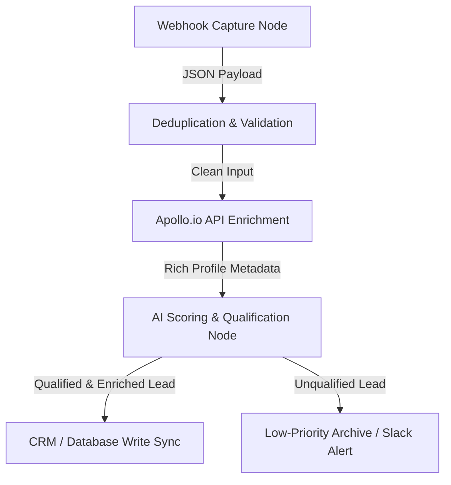

In modern outbound sales and marketing operations, **speed and data accuracy are the ultimate growth multipliers**. Manual prospecting, unstructured scraping, and dirty lead sheets are the silent killers of SaaS GTM pipelines. If your sales representatives are spending hours manually searching for phone numbers, copying LinkedIn profiles, or trying to qualify leads one by one, your customer acquisition cost (CAC) is bleeding.

To win in high-velocity markets, hyper-growing teams build a **highly optimized n8n lead enrichment pipeline** to automate B2B outbound workflows. 

By combining the workflow orchestration power of **n8n** with the massive B2B database of the **Apollo.io API** and the cognitive intelligence of an LLM, you can construct a self-healing outbound machine that operates 24/7. *(Lead enrichment is just one layer of your GTM infrastructure. To see how to align your entire revenue tech stack, check out our architectural teardown of the [SaaS RevOps Automation Stack](/blog/revops-automation-stack-saas-2026/))*. *(If you want our team of experts to design and build this custom workflow for you, check out our [n8n Automation Services](/services/n8n-automation/))*. This article provides a comprehensive, step-by-step production blueprint to building a production-grade lead enrichment pipeline in under two hours.

---

## <mark>Why Does Manual Lead Enrichment Fail at Scale?</mark>

Most marketing and revenue operations suffer from a massive latency gap. When a visitor fills out a contact form or triggers an intent beacon, the lead is often routed to a database with nothing but an email address and a name. Before a sales development representative (SDR) can write a personalized outbound message, they must manually enrich the contact:

1. Search for the company domain on Google.
2. Look up the contact's LinkedIn profile to verify their title.
3. Cross-reference their corporate tech stack.
4. Estimate company headcount, funding stage, and industry verticals.

This manual loop takes anywhere from **10 to 20 minutes per lead**. If your campaign generates 500 leads a day, you are burning over 80 hours of manual labor per week on raw data entry. *(To identify other hidden automation bottlenecks in your current marketing and sales systems, claim your free custom [RevOps & Pipeline Audit](/audit/))*. 

Furthermore, data quality decays quickly. Over 30% of B2B professionals change roles, company names, or email domains annually. Static databases decay faster than they can be populated.

An automated B2B data enrichment system solves this latency by executing **instant, programmatic API lookups** at the exact millisecond a lead is captured. By enriching the data immediately, your systems can score, route, and personalize outreach asynchronously—allowing your SDRs to focus solely on high-value conversations.


---

## <mark>The Lead Enrichment Pipeline Architecture</mark>

To ensure reliability, scalability, and performance, our pipeline is designed around a **five-stage decoupled architecture**. 

Instead of building a single, fragile monolithic script, we split the workflow into discrete modules. This makes troubleshooting, rate-limit management, and scaling simple.



### The 5-Stage Decoupled Workflow:

* **Stage 1: Webhook Capture Node:** A public HTTP endpoint listening for inbound payloads from lead forms, ads, or chatbot hooks.
* **Stage 2: Validation & Deduplication:** Pre-flight checks inside **n8n** to verify that the payload contains a valid email address and to check if the lead already exists in your CRM, preventing duplicate API costs.
* **Stage 3: Apollo.io API Enrichment:** A dynamic HTTP request to Apollo’s **People Enrichment API**, returning direct phone numbers, LinkedIn URLs, company revenue, funding history, and exact employee headcount.
* **Stage 4: AI Lead Scoring (LLM Node):** Sending the enriched profile metadata to a localized LLM prompt to grade the lead (A, B, C, D) based on Ideal Customer Profile (ICP) parameters.
* **Stage 5: CRM Sync & Notification:** Pushing qualified leads directly into your sales CRM (e.g., **Brevo** or **HubSpot**) and alerting your sales team on **Slack** with a rich markdown profile summary.


---

## <mark>Step-by-Step Pipeline Implementation Guide</mark>

Below is the step-by-step implementation guide to configuring each node inside your **n8n** workflow.

### How do you configure the Inbound Webhook?

The pipeline starts with an **n8n Webhook Node**. This node acts as the secure entry point. 

To keep the pipeline robust, set the **HTTP Method** to `POST` and ensure the **Response Mode** is set to `onReceived`. Returning a immediate `200 OK` status immediately on receipt of the webhook ensures that upstream webhook providers (like Webflow, Typeform, or Facebook Lead Ads) do not timeout while the pipeline is processing downstream API calls. 

*(Avoid setting `responseMode` to `responseNode` unless you have configured a dedicated webhook response node downstream, as this will cause the webhook execution to hang and timeout).*

```json
{
  "name": "Webhook Lead Ingest",
  "parameters": {
    "httpMethod": "POST",
    "path": "lead-enrichment-ingest",
    "responseMode": "onReceived",
    "responseData": "allEntries"
  }
}
```

### How do you authenticate Apollo.io in n8n?

Once the webhook receives a valid B2B lead payload, the email is extracted. We use a **Custom HTTP Request Node** in **n8n** to call the **Apollo.io API** People Enrichment endpoint.

To keep authentication secure in production and avoid leaking credentials in execution history logs, **never pass your API key inside the request body**. Instead, pass it as a secure header key.

#### API Endpoint Specifications:
* **Endpoint URL:** `https://api.apollo.io/v1/people/match`
* **HTTP Method:** `POST`
* **Headers:**
  * `Content-Type: application/json`
  * `Cache-Control: no-cache`
  * `X-Api-Key: YOUR_APOLLO_API_KEY`
* **JSON Request Body:**
  ```json
  {
    "email": "={{ $json.body.email }}",
    "reveal_personal_emails": true,
    "reveal_phone_number": true
  }
  ```

#### The Apollo.io Return JSON Payload Schema:
The match API returns a highly detailed JSON object structured as follows, containing both contact and organization metadata:
```json
{
  "person": {
    "id": "person_987654321",
    "first_name": "Alfaz",
    "last_name": "Mahmud",
    "title": "Lead RevOps Engineer",
    "email": "alfaz@example.com",
    "linkedin_url": "https://www.linkedin.com/in/whoisalfaz",
    "organization": {
      "name": "Alfaz Tech",
      "website_url": "https://whoisalfaz.me",
      "estimated_num_employees": 45,
      "annual_revenue": 8500000,
      "short_description": "Custom B2B workflow engineering and technical automation solutions.",
      "industries": ["Software", "Internet Services"]
    }
  }
}
```

> ⚠️ **Apollo.io Rate Limits Sidebar:**
> **Apollo** enforces strict API rate limits based on your subscription tier (e.g. Free: 10/min; Professional: 120/min; Enterprise: 200/min). Apollo communicates these limits via these response headers:
> * `X-RateLimit-Limit`: Maximum requests allowed per minute.
> * `X-RateLimit-Remaining`: Requests remaining in the current window.
> * `X-RateLimit-Reset`: UTC epoch timestamp indicating when the limit resets.
> Make sure to enable the **Retry On Failure** toggle in n8n's node settings with an exponential backoff to handle rate limits (`429` responses) gracefully.

### How to configure OpenAI/Anthropic in n8n for lead scoring?

Raw data is useful, but it requires human cognitive processing to interpret. To automate this step, we feed the **Apollo.io API** payload into an **n8n Basic AI Agent** or **OpenAI/Anthropic Chat Node**.

We write a strict prompt instructing the model to act as an automated RevOps qualification engine. To prevent context breakage inside complex n8n workflows, we use **explicit node references** to access the Apollo data, rather than generic `$json` calls.

#### The Advanced Qualification System Prompt:
```text
You are a high-performance RevOps lead qualification assistant. 
Analyze the following company and contact metadata provided by our enrichment engine:

Contact Title: {{ $('Apollo HTTP Request').item.json.person.title }}
Company Description: {{ $('Apollo HTTP Request').item.json.person.organization.short_description }}
Company Headcount: {{ $('Apollo HTTP Request').item.json.person.organization.estimated_num_employees }}
Company Annual Revenue: {{ $('Apollo HTTP Request').item.json.person.organization.annual_revenue }}
Target ICP Criteria:
- Ideal industries: SaaS, AI/ML, Logistics, B2B Agencies
- Preferred Job Titles: Founder, CEO, VP of Sales, CTO, CMO, RevOps Director
- Headcount range: 10 to 250 employees

Evaluate the data. Output a raw JSON object containing exactly three keys:
1. "score": A numeric value from 0 to 100 indicating ICP alignment.
2. "grade": A string value ("A", "B", "C", "D") representing lead tier.
3. "summary": A concise 2-sentence summary explaining why the lead was graded this way.

Format your output ONLY as valid JSON. Do not include markdown code blocks or explanations outside the JSON object.
```

By grading the lead programmatically, you can automatically separate high-ticket enterprise targets from low-value test submissions.

### How to build HubSpot/Brevo CRM Sync Loops?

Following the AI node, use an **n8n Router Node** or **If Node** to evaluate the grade. 

**Pro-Tip: Avoid direct creates.** Pushing contact payloads directly to your CRM without pre-flight lookups is a recipe for duplicate data pollution. Always implement the **CRM Upsert Pattern**:
1. **Search Contact:** Query your CRM by email to see if the contact already exists.
2. **Evaluate ID:** Insert an n8n IF node to check if a record ID was returned.
3. **Branch 1 (Update):** If the contact exists, route to an Update Node (`PUT`/`PATCH` API request) to append the enrichment scores and metadata to the existing record.
4. **Branch 2 (Create):** If the contact does not exist, route to a Create Node (`POST` API request) to register a new record.

*(For a deeper step-by-step walkthrough on syncing qualified leads and triggering automated outbound sequences in your CRM, see our complete guide on [syncing Apollo.io leads to Brevo CRM with n8n](/blog/apollo-brevo-n8n-outbound-pipeline/))*.

Here is the HTML layout representing our lead score routing framework:

<table class="w-full text-left border-collapse border border-slate-700 my-6 transition-all duration-300 hover:shadow-lg">
  <thead>
    <tr class="bg-slate-800/90 text-slate-200 border-b border-slate-700">
      <th class="p-3 border border-slate-700 font-bold uppercase tracking-wider text-xs">Lead Grade</th>
      <th class="p-3 border border-slate-700 font-bold uppercase tracking-wider text-xs">ICP Alignment</th>
      <th class="p-3 border border-slate-700 font-bold uppercase tracking-wider text-xs">Automated GTM Action</th>
    </tr>
  </thead>
  <tbody>
    <tr class="border-b border-slate-700 bg-slate-900/50 hover:bg-slate-800/40 transition-colors duration-150">
      <td class="p-3 border border-slate-700 text-emerald-400 font-bold text-sm">Grade A</td>
      <td class="p-3 border border-slate-700 text-sm">Perfect Match (Target Roles + SaaS/AI Tier)</td>
      <td class="p-3 border border-slate-700 text-sm font-mono text-slate-300">Sync CRM + Alert Slack + Trigger High-Value Sequence</td>
    </tr>
    <tr class="border-b border-slate-700 bg-slate-900/30 hover:bg-slate-800/40 transition-colors duration-150">
      <td class="p-3 border border-slate-700 text-cyan-400 font-semibold text-sm">Grade B</td>
      <td class="p-3 border border-slate-700 text-sm">Strong Match (Middle Management + B2B Scale)</td>
      <td class="p-3 border border-slate-700 text-sm font-mono text-slate-300">Sync CRM + Add to SDR Manual Tasks Queue</td>
    </tr>
    <tr class="border-b border-slate-700 bg-slate-900/10 hover:bg-slate-800/40 transition-colors duration-150">
      <td class="p-3 border border-slate-700 text-amber-500 font-medium text-sm">Grade C</td>
      <td class="p-3 border border-slate-700 text-sm">Low Alignment (Non-Target Roles / Tech Stack mismatch)</td>
      <td class="p-3 border border-slate-700 text-sm font-mono text-slate-300">Add to Weekly Email Newsletter Nurture Sequence</td>
    </tr>
    <tr class="bg-slate-900/50 hover:bg-slate-800/40 transition-colors duration-150">
      <td class="p-3 border border-slate-700 text-rose-500 font-medium text-sm">Grade D</td>
      <td class="p-3 border border-slate-700 text-sm">No Alignment (Students, Personal Emails, Junk data)</td>
      <td class="p-3 border border-slate-700 text-sm font-mono text-slate-300">Archive lead automatically. Prevent CRM clutter.</td>
    </tr>
  </tbody>
</table>

---

## <mark>Why Does n8n Timeout on Inbound Webhooks?</mark>

One of the most common RevOps architecture failures is the **upstream timeout**. 

Most form builders, webhook relays, and landing pages enforce a strict response timeout window of **10 seconds**. If your pipeline makes multiple synchronous API lookups (e.g. validating email → querying Apollo → prompting **OpenAI** → pushing to CRM), the entire flow can easily exceed 12 seconds. When this happens, the upstream form provider aborts the webhook request, resulting in lost leads and broken telemetry.

To solve this, you must construct an **Asynchronous Callback Queue Architecture**.

Instead of holding the webhook open while **n8n** executes the enrichment nodes, split the workflow into **two separate, decoupled systems** bridged by a queue manager:

1. **The Ingestion Workflow:** Webhook captures lead details, immediately pushes the raw payload into a message broker or an internal **n8n** database, and returns a fast `200 OK` response to the form builder in under **150 milliseconds**.
2. **The Processing Workflow:** A secondary cron-triggered or event-driven workflow that pulls the raw payloads from the queue, runs all API calls, prompts the LLM, and updates the CRM asynchronously.

#### Native n8n Async Queue Setup:
To build a non-blocking queue natively in n8n, route your inbound Webhook node immediately to an **Execute Workflow** node that calls your secondary processing workflow. 

In the settings of the **Execute Workflow** node, **disable the "Wait for Sub-workflow to finish" parameter**. This triggers the secondary workflow in a separate async thread, allowing the main workflow to immediately execute a 'Respond to Webhook' node, returning a `200 OK` in under 150ms while the heavy API lift runs in the background.

---

## <mark>Self-Healing Error Handling: Designing for 99.9% Pipeline Uptime</mark>

APIs fail. **Apollo.io** may experience minor rate limits, your **OpenAI** API key might temporarily hit token ceilings, or **HubSpot's** servers could go down. If you do not design for failure, a single API error will kill the entire execution, dropping the lead completely.

To build a self-healing pipeline inside **n8n**:

* **Handling the "No Match" API Failure:** If **Apollo** fails to match an email (e.g. personal domains), it returns a status of `200` but with a `person: null` payload. The downstream AI node will crash trying to parse null data. Always place an **IF Node** after Apollo to verify if `{{ $('Apollo HTTP Request').item.json.person }}` is null. If it is null, route the lead to a "Low Enrichment" CRM path, bypassing the AI node completely.
* **Use "Retry On Failure" node parameters:** On both the **Apollo.io** and AI qualification nodes, open the node settings, enable the **Retry On Failure** toggle, set the **Max Retries** to `3`, and set the **Retry Interval** to `60` seconds with an exponential backoff.
* **Error Workflows and Redirect Ports:** Do not try to draw lines directly to an Error Trigger node (which is a starting trigger). Instead, open node settings and set **On Error** to **Redirect to error port** to branch out local failures. For global workflow errors, configure a dedicated **Error Workflow** inside the workflow settings to catch unhandled execution logs, archive them in **Google Sheets**, and send urgent alerts to your **Slack** developer channel.

*(For a complete architectural breakdown on building bulletproof enterprise workflows that handle rate-limits and node errors on autopilot, read our master guide on [Self-Healing n8n Automation Architecture](/blog/self-healing-n8n-automation-architecture/))*.

---

## <mark>The RevOps ROI: Strategic Business & Pipeline Impact</mark>

Beyond the code blocks and API endpoints, building an **n8n lead enrichment pipeline** yields massive business returns. For a scaling B2B agency or SaaS startup, automating data operations is not a technical vanity project—it is a financial necessity. 

* **Maximizing Outbound Sales Velocity:** Sales representatives are highly paid negotiators, not data entry clerks. By offloading lead research to an automated background thread, your SDRs spend **95% less time prospecting** and **100% of their energy booking meetings**.
* **Protecting CRM Integrity & Cost:** Standard CRM systems charge pricing tiers based on total database size. By automatically routing unqualified Grade D leads (students, test entries, personal domains) straight to low-cost archival databases, you save thousands of dollars in CRM database overhead.
* **Hyper-Personalized Dynamic Email Sequences:** Having enriched metadata (estimated revenue, tech stack, employee counts) mapped inside your CRM allows you to instantly trigger hyper-targeted email copy. Instead of generic blasts, your system automatically triggers personalized outbound copy: *"Since you are managing a SaaS team of 50 people using monday.com..."* which drives outreach conversion rates through the roof.

---

## <mark>Outsource vs. In-House: The Automation Architect's Verdict</mark>

When deploying enterprise-level GTM automation, SaaS founders frequently face a classic dilemma: *Should we build this pipeline in-house or outsource it to a dedicated automation architect?*

While **n8n** makes workflow orchestration visual, maintaining production-grade pipelines at scale requires deep infrastructure expertise:
* **In-House Setup:** Requires dedicating engineering resources to monitor API rate limits, update database schemas when APIs change, build error-alert structures, and manage hosting servers. This distracts your core product team from building your actual SaaS features.
* **Outsourced RevOps Partner:** Outsourcing to an experienced automation agency guarantees that your pipeline is built on robust, asynchronous, self-healing frameworks with complete multi-tool integrations (ManyChat, Apollo, Brevo, HubSpot, etc.). It gives you a production-ready engine on Day 1 without hiring full-time engineers.

If you are looking to scale your B2B outbound operations, audit your pipeline, or deploy custom integrations that run 24/7 on autopilot, get in touch with our team today to discuss your next **[RevOps & Pipeline Strategy](/contact/)**.

---

## <mark>Verification: Pipeline Performance Benchmarks</mark>

To verify that your newly deployed lead enrichment pipeline is functioning optimally, audit the system using these three performance telemetry metrics:

* **Enrichment Match Rate:** The percentage of inbound email addresses that successfully return company and profile data from Apollo.io. Target: **> 78% for B2B domains**.
* **E2E Pipeline Latency:** The total execution time from webhook ingest to CRM write. With our asynchronous queue architecture, the user-facing latency must remain **< 200ms**, and the backend enrichment must complete **< 30 seconds**.
* **AI Scoring Accuracy:** Run a manual audit on a batch of 100 leads once a month to compare AI grades against human grades. The AI classification should match human experts with **> 92% precision**.

Deploy this automation stack today, eliminate manual outbound bottlenecks, and let your revenue operations run on autopilot!
