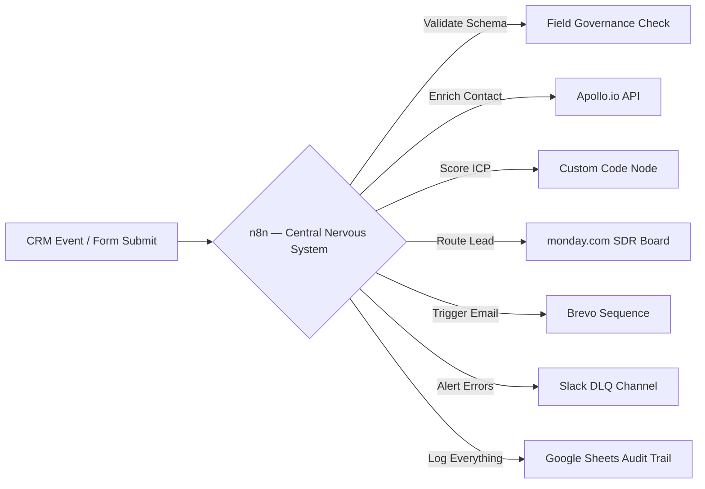

If you have searched "what is RevOps" and landed on a post that opens with "RevOps stands for Revenue Operations and aligns your go-to-market teams" — close it. You already know that much. This post is the **technical operator's definition**: what RevOps actually *is* architecturally, why most SaaS teams implement it wrong, and exactly how to build it at your current ARR stage.

**Revenue Operations (RevOps)** is a centralized operational model that unifies Marketing, Sales, and Customer Success under a single data infrastructure, shared process design, and integrated technology stack — with the goal of creating predictable, full-lifecycle revenue growth.

It is not a team rename. It is not hiring a "RevOps manager" to fix your HubSpot. It is the plumbing of your entire revenue engine.

---

## <mark>RevOps vs. Sales Ops vs. Marketing Ops: The Structural Difference</mark>

Most SaaS companies under $5M ARR operate what is technically called a **Frankenstack** — a collection of siloed ops functions that each optimize their own department metrics while accidentally destroying company-wide revenue predictability.

| Function | Scope | Primary Metric | Problem |
|---|---|---|---|
| **Sales Ops** | Sales team only | Quota attainment, pipeline activities | Cannot see marketing intent signals or CS churn patterns |
| **Marketing Ops** | Marketing team only | MQL volume, campaign attribution | Defines MQL differently than Sales defines SQL |
| **CS Ops** | Customer success only | NPS, renewal rate | Operates in a silo — no data bridge to Sales pipeline |
| **RevOps** | Marketing + Sales + CS + Finance | Predictable ARR, NRR, CAC:LTV | Unified — all teams share one source of truth |

The Frankenstack result: a deal closes in Salesforce but CS doesn't get the contract data for 48 hours. Marketing reports 400 MQLs; Sales says 12 of them were actually qualified. Finance's ARR number doesn't match the CRM. Sound familiar?


### The Three Silent Revenue Killers in Siloed Ops

- **Siloed intent data:** Your marketing platform knows a prospect visited your pricing page 6 times. Your SDR sending a cold sequence has no idea.
- **Handoff friction:** When a deal closes, someone manually copies contract terms into a CS onboarding sheet. This creates a 24–48 hour delay and immediate trust erosion with the customer.
- **Silent sync failures:** Native tool integrations sync on fixed schedules. When they fail (API limits, field mismatches), they fail silently — creating duplicate records and corrupted pipeline data nobody catches for weeks.

RevOps solves all three by establishing an **orchestration layer** (more on that below) that owns the data flow between every system.

---

## <mark>The 4 Pillars of RevOps Architecture</mark>

Every mature RevOps function rests on four pillars. Weakness in any one of them makes the whole system unreliable.

### Pillar 1 — Unified Data Infrastructure

Before you automate anything, every team must agree on what words mean. What counts as an MQL? At what point does a prospect become an SQL? What triggers a PQL (product-qualified lead)?

This sounds obvious. In practice, at most SaaS companies under $10M ARR, Marketing and Sales define these terms differently — and nobody has written it down.

**The fix:** Create a **B2B field governance schema** — a single document that defines every core GTM field, its data type, its allowed values, and who owns it. At minimum:

- `lifecycle_stage`: subscriber → mql → sql → opportunity → customer → churned
- `lead_status`: new → enrichment_pending → outreach_active → disqualified
- `lead_source`: exact UTM-mapped values (no free-text)
- `automation_origin`: automation_engine / human_rep / api_ingest

This schema is then enforced across your CRM, your work OS (e.g. **monday.com**), and your automation orchestrator (**n8n**), laying a structured data foundation similar to the Next.js and database architecture detailed in our [Client Portfolio Delivery case study](/blog/case-study-client-portfolio-delivery). If the data isn't standardized, your automations push garbage downstream.

### Pillar 2 — Aligned Process Design & Handoffs

RevOps owns the documented workflow from first marketing touch → closed deal → CS onboarding → renewal → expansion. Every handoff between teams is a structured, automated trigger — not a Slack message.

The minimum viable handoff process map:
```
Marketing Touch → MQL Score Threshold → 
n8n Webhook → Enrich via Apollo → 
Lead Score → Route to SDR via Weighted Round-Robin → 
Outreach Sequence (Brevo) → Meeting Booked → 
CRM Stage Update → CS Onboarding Trigger
```

No step in this chain should require a human to manually move data between systems.

### Pillar 3 — Integrated Technology Stack (n8n as the Orchestration Brain)

This is where most RevOps implementations fail. Teams buy expensive native integrations (HubSpot ↔ monday.com, Apollo ↔ Brevo) and assume the sync "just works." It doesn't.

Native integrations are designed for static data transfer. Production RevOps pipelines require **dynamic conditional logic, deduplication, validation, and error routing** — none of which native plugins provide.

**n8n** functions as your Central Nervous System: the API-first orchestration layer that sits between all your tools and owns every data movement decision. Unlike Zapier or Make, n8n lets you build production-grade workflows with:

- Custom JavaScript/Python logic inside Code Nodes
- Retry policies with exponential backoff
- Webhook signature validation
- Global Error Trigger catch-all with Slack DLQ alerts
- Self-hosted deployment for full data sovereignty

For a full teardown of this architecture, see our [complete RevOps automation stack breakdown](/blog/revops-automation-stack-saas-2026/) and the [Apollo→Brevo→n8n pipeline walkthrough](/blog/apollo-brevo-n8n-outbound-pipeline/) we built for a B2B SaaS client.

### Pillar 4 — Measurement Cadence & Shared KPIs

RevOps replaces departmental metrics with a shared KPI stack that leadership reviews in one dashboard. **Databox** is the reporting layer we recommend for this — it pulls live data from HubSpot, monday.com, [Google Analytics](/blog/n8n-google-analytics-4-pipeline), Facebook Ads, and Stripe (which we integrated with a custom headless storefront in the [Veloryc Premium E-Commerce case study](/blog/case-study-veloryc-premium-ecommerce/)) into a single real-time view.

The three metrics every RevOps function must track:

| Metric | Formula | Target |
|---|---|---|
| **Sales Lead Velocity (SLV)** | Time from webhook ingestion → SDR outreach task | < 60 seconds |
| **Pipeline Coverage Ratio** | Active pipeline / Revenue target × 100 | > 300% |
| **Revenue Retention (NRR)** | (Starting MRR + Expansion − Churn − Contraction) / Starting MRR | > 100% |

If your NRR is below 100%, no amount of new pipeline will save you. RevOps makes this visible — and fixable.

---

## <mark>The 3-Tier RevOps Stack by ARR Stage</mark>

The most common RevOps mistake: copying an enterprise stack at the seed stage. If you deploy Salesforce, Gong, and LeanData at $500K ARR, the licensing costs and operational overhead will kill your team. Your stack must evolve with your revenue.


### Tier 1 — Under $2M ARR (The Lean Startup Stack)

**Goal:** Maximize lead ingestion speed and outbound reach with minimal maintenance overhead.

| Tool | Role | Cost |
|---|---|---|
| HubSpot CRM (Starter) | Single source of truth, pipeline, basic email | $50/mo |
| Apollo.io | Contact database, sequences, email verification | $49/mo |
| **n8n** (Self-hosted) | Orchestration brain — lead routing, enrichment, notifications | $0 (hosting ~$10/mo) |
| Brevo | Transactional email delivery, contact storage | $25/mo |
| Google Sheets | Lightweight reporting (which you can build using our guide to [automate client reporting with n8n](/blog/automate-client-reporting-with-n8n)) | $0 |

At this stage, your n8n workflows are simple: webhook → Apollo enrich → Brevo contact create → Slack notify SDR. No round-robin routing needed. No complex ICP scoring yet. Just make sure every lead is captured, enriched, and notified — automatically.

See our [Apollo.io lead enrichment pipeline tutorial](/blog/n8n-apollo-lead-enrichment-pipeline/) for the exact workflow JSON.

### Tier 2 — $2M–$10M ARR (The High-Velocity Scale-Up)

**Goal:** Scale outbound volume, automate post-sales CS handoffs, and track pipeline velocity in real time.

| Tool | Role |
|---|---|
| HubSpot CRM or Salesforce | CRM + single source of truth (more complex custom objects) |
| **monday.com** | Work OS — SDR task routing, CS onboarding boards, RevOps queues |
| Apollo.io + Clay | Enrichment with multi-source waterfall (Apollo → LinkedIn → Clearbit) |
| **n8n Cloud** | Central Nervous System — API-first orchestration across all tools |
| Brevo | Transactional + marketing email sequences |
| **Databox** | Real-time unified reporting dashboard pulling from CRM, Ads, Finance |

At Tier 2, you add weighted round-robin lead distribution (built in n8n, not a paid CRM add-on), bidirectional CRM↔monday.com sync, ICP scoring, and automated CS handoff triggers when a deal closes.

### Tier 3 — $10M+ ARR (The Enterprise Infrastructure)

**Goal:** Predictive forecasting, conversation intelligence, and enterprise-grade data governance.

- **Salesforce Enterprise** with custom schemas and territory management
- **Gong** for conversation intelligence and deal health AI scoring
- **Clay** + **ZoomInfo** for enterprise enrichment waterfall
- **LeanData** for complex account-based routing
- **n8n Self-Hosted** as the orchestration layer for custom integrations that Salesforce's native connectors can't handle
- **Databox** or Tableau for executive-level reporting

Even at enterprise scale, n8n remains the orchestration layer for edge cases — custom field validation, legacy system integrations, real-time alert pipelines — because no iPaaS handles these as cleanly without engineering overhead.

---

## <mark>Why n8n Beats Native Sync as Your RevOps Engine</mark>

We've referenced n8n throughout this post because it's the single tool that makes or breaks a RevOps implementation at any ARR stage. Here's the technical reason why native integrations fail and n8n succeeds:



**What native sync cannot do:**
- Check if a contact already exists before creating a duplicate (deduplication)
- Route leads to different sequences based on ICP score thresholds
- Handle API rate limits gracefully with exponential backoff
- Catch and log silent failures to a Dead Letter Queue
- Validate field schemas before pushing dirty data downstream
- Prevent circular sync loops with origin metadata flags

**What n8n does natively:** all of the above, in a visual workflow editor, with custom JavaScript execution in Code Nodes (read our master list of [n8n Tips and Tricks](/blog/n8n-tips-and-tricks-by-alfaz-mahmud-rizve/) for advanced techniques), full error handling via Error Trigger, and zero vendor lock-in because it's open source.

This is why the [Apollo→Brevo outbound pipeline](/blog/apollo-brevo-n8n-outbound-pipeline/) we built for a client (which also leverages custom [Apollo n8n outreach](/blog/apollo-n8n-outreach/) setups) reduced lead-to-outreach time from 48 hours to under 4 minutes — the automation does what no native sync plugin can.

---

## <mark>Week 1 RevOps Quick-Start Checklist</mark>

If you're starting from zero, here is the minimum viable RevOps implementation for a SaaS team under $2M ARR:

**Day 1–2: Field Governance**
- [ ] Define and document `lifecycle_stage` and `lead_status` values in your CRM
- [ ] Standardize `lead_source` to match UTM parameters exactly
- [ ] Add `automation_origin` custom field to your CRM (prevents circular sync loops)

**Day 3–4: Orchestration Setup**
- [ ] Deploy [n8n self-hosted](/blog/what-is-n8n-and-how-to-set-it-up) (Docker + Postgres + Redis on a $10/mo VPS)
- [ ] Build your first webhook → Apollo enrich → Brevo create workflow
- [ ] Add a Slack Error Trigger node for DLQ alerting

**Day 5: Reporting**
- [ ] Connect HubSpot/Salesforce, Google Analytics, and Brevo to Databox
- [ ] Create a shared dashboard with SLV, Pipeline Coverage, and NRR
- [ ] Schedule a weekly RevOps review meeting with Sales and CS leads

**Day 6–7: Process Documentation**
- [ ] Map every team handoff on a flow diagram (Miro or FigJam)
- [ ] Identify the top 3 manual tasks your team does that generate >1 hour/week of work
- [ ] Prioritize those 3 for automation in Week 2

---

## <mark>Frequently Asked Questions</mark>

**What does a RevOps team actually do day-to-day?**
A RevOps team owns four functions: maintaining the CRM data integrity, building and maintaining automation workflows (lead routing, enrichment, handoffs), managing the tech stack (contracts, integrations, upgrades), and running the weekly revenue forecast cadence. At early-stage SaaS companies, one RevOps architect handles all four; at scale, the function splits into RevOps Analysts, Engineers, and a VP of Revenue Operations.

**When should a SaaS company hire a RevOps lead?**
Most founders wait too long. The right trigger is when you have more than two go-to-market motions running simultaneously (e.g. inbound + outbound) and your pipeline data is inconsistent between Marketing and Sales reports. That's the Frankenstack showing its cracks. Typically this happens between $500K and $2M ARR.

**What's the difference between RevOps and CRM admin?**
CRM admin maintains your HubSpot or Salesforce — updating fields, managing users, fixing broken contacts. RevOps *architects* the strategy that determines what fields exist, what triggers automation, how leads flow, and how revenue is measured. CRM admin is a tactical execution role. RevOps is a strategic infrastructure role.

**How long does it take to implement RevOps?**
A minimum viable RevOps function (field governance + basic orchestration + shared reporting) can be implemented in 2–4 weeks with the right tooling. A full enterprise-grade RevOps overhaul (Salesforce customization + n8n multi-workflow orchestration + Databox executive dashboards) typically takes 8–12 weeks. Our [growth consulting service](/services/growth-consulting/) includes a 50-point RevOps audit delivered in 72 hours.

**Can n8n replace a full RevOps platform like LeanData or Openprise?**
For most SaaS companies under $20M ARR — yes. LeanData and Openprise are purpose-built for enterprise-scale routing and deduplication at hundreds of thousands of leads per month. Below that volume, n8n's Code Nodes can replicate 90% of their functionality at a fraction of the cost. Above $20M ARR or 10K+ leads/month, a purpose-built platform starts making economic sense.

**How do I know if my RevOps is working?**
Three metrics: (1) Sales Lead Velocity under 60 seconds from form submit to SDR outreach task. (2) Pipeline Coverage Ratio above 300%. (3) NRR above 100% (ideally 110–120% for healthy expansion revenue). If all three are green, your RevOps is functioning. If any one is red, you have a specific architectural problem to solve.

---

## <mark>Conclusion</mark>

RevOps is not a hire. It is not a HubSpot cleanup project. It is an architectural decision to run your entire revenue lifecycle as a single, automated, data-governed system — with **n8n** as the orchestration brain, **monday.com** as the work OS, **Databox** as the measurement layer, and **Brevo** as the outreach delivery engine.

The SaaS companies that implement this architecture early — even at $500K ARR with a lean Tier 1 stack — grow faster, forecast more accurately, and retain customers longer than those that rely on tribal knowledge and manual handoffs.

If you want a professional assessment of where your current stack stands and what it would take to build a production-grade RevOps infrastructure, [book a strategy call or request a free technical audit](/contact/).
