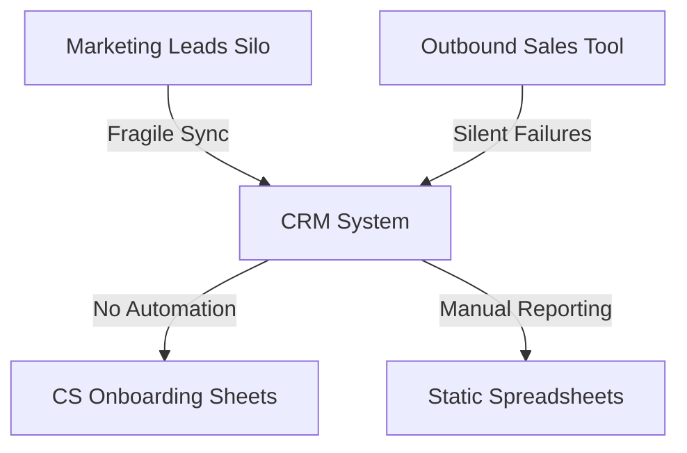
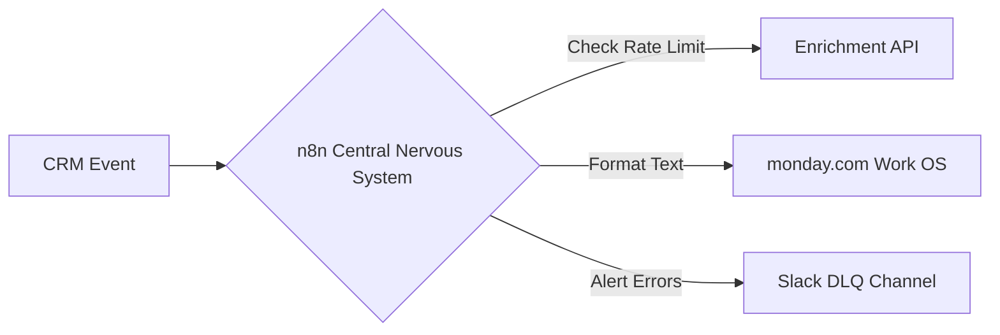

In the hyper-competitive landscape of modern B2B SaaS, **operational efficiency is no longer a luxury—it is the dividing line between hyper-growth and stagnation**. Yet, the typical software stack at a scaling startup resembles a digital house of cards. Marketing collects leads in one silo; Sales runs outbound from another; Customer Success logs accounts in a third. 

This fragmented structure, known as a **Frankenstack**, results in data drift, high customer churn, and massive manual pipeline bottlenecks.

To scale predictably, high-velocity teams abandon fragmented point solutions in favor of a **highly orchestrated RevOps automation stack**. By establishing a CRM foundation, an API-first orchestration brain (**n8n**), a centralized process workspace (**monday.com**), and a real-time analytics hub (such as the [Databox RevOps Dashboard](/blog/databox-revops-dashboard-pipeline-velocity/)), you can eliminate manual bottlenecks and let your revenue operations run on autopilot. This guide provides a complete, production-grade architectural teardown of the modern RevOps stack in 2026.

---

## <mark>The Frankenstack Epidemic: Why SaaS Pipelines Bleed Revenue</mark>

A **Frankenstack** is an integrated collection of software tools that have been patched together using fragile, out-of-the-box native sync plugins. 

While each individual tool (e.g. your email marketing platform or outbound sales tool) is powerful, the connections between them are brittle.



### The Three Silent Killers of SaaS GTM Pipelines:

* **Siloed UTM Telemetry:** When a prospect interacts with a marketing campaign but outbound sales reps cannot see their high-intent search signals, the outreach is generic, driving conversion rates down.
* **Manual Data Ingestion Latency:** When a deal closes, CS managers must manually copy contract details, create onboarding boards, and set up slack channels. This manual overhead creates a 24-to-48-hour onboarding delay, immediately impacting customer trust.
* **Silent Native Sync Failures:** Out-of-the-box plugins sync data at fixed intervals. If an API limit is reached or a custom field mismatch occurs, the sync fails silently, creating duplicate records and dirty pipelines.

To solve this, RevOps architects must transition from simple "native plug-and-play" connections to a **centralized, API-first orchestration layer**.


---

## <mark>The 3-Tier RevOps Stack Lifecycle Blueprint</mark>

A common mistake is copying an enterprise stack too early. If a seed-stage startup deploys Salesforce, Gong, and LeanData, the licensing costs and technical overhead will drown the team. 

Your stack must evolve naturally with your Revenue and scale.

### Tier 1: The Lean Startup Stack (under $2M ARR)
* **Goal:** Maximize lead ingestion speed and outbound outreach with minimal maintenance overhead.
* **Foundation:** HubSpot CRM (acting as CRM, marketing hub, and simple sales pipeline).
* **Enrichment:** **Apollo.io** (direct email and phone number matching).
* **Orchestration:** **n8n** (triggering automated lead routing and simple notifications).

### Tier 2: The High-Velocity Scale-Up Stack ($2M - $10M ARR)
* **Goal:** Scale outbound outbound volumes, automate post-sales CS handoffs, and track pipeline velocity in real time.
* **Foundation:** **HubSpot CRM** or **Salesforce** (as the Single Source of Truth).
* **Work OS:** **monday.com** (to manage client onboarding, SDR task routing, and custom RevOps queues).
* **Orchestration:** **n8n Cloud** (operating as the API-first Central Nervous System).
* **Analytics:** **Databox** (pulling real-time statistics from CRM, advertising platforms, and financial sheets into one unified, live dashboard).

### Tier 3: The Enterprise Infrastructure ($10M+ ARR)
* **Goal:** Predictive forecasting, conversation intelligence, and enterprise-grade data governance.
* **Foundation:** **Salesforce Enterprise** (highly customized schemas).
* **Revenue Intelligence:** **Gong** and **Clari** (for AI-driven deal health tracking and forecasting).
* **Enrichment:** **Clay** (orchestrating multiple data scrapers) and **ZoomInfo**.
* **Orchestration:** **n8n Self-Hosted** + **LeanData** (highly complex routing logic).

---

## <mark>The Orchestration Layer: Why API-First n8n Beats Native Sync</mark>

Native sync plugins are designed for static data transfer. If Field A changes in HubSpot, change Field A in monday.com. 

However, production RevOps pipelines require **dynamic conditional logic, validation filters, and error routing**.



By leveraging **n8n** as your central RevOps broker, you decouple your applications. n8n acts as the central brain that:
1. **Validates Payload Structure:** Pre-checks data to ensure fields conform to your standardized data schema before pushing to CRMs.
2. **Handles Rate-Limits Gracefully:** Utilizes retry-on-failure parameters and exponential backoff loops to navigate API limits (e.g. Apollo's minute limits) without losing executions.
3. **Implements Advanced Conditional Routing:** Automatically routes contacts to different sequences based on real-time calculations that native plugins cannot compute.

*(To see this orchestration brain in action, read our master tutorial on [building a production n8n lead enrichment pipeline with Apollo](/blog/n8n-apollo-lead-enrichment-pipeline/))*.


---

## <mark>The 'Data Gravity' Challenge: Solving Bidirectional Sync and Circular Loops</mark>

When syncing contacts bidirectionally between your CRM and your Work OS (e.g. **monday.com**), you run into a classic engineering bottleneck: **The Infinite Circular Sync Loop**.

```text
Change in HubSpot CRM ➡️ Triggers Webhook ➡️ Updates monday.com Board 
                                                     ⬇️
Updates HubSpot CRM ⬅️ Triggers Webhook ⬅️ monday.com Board Detects Change
```

This infinite loop will completely deplete your API limits within minutes and corrupt your database history logs.

### The Solution: Metadata Modification Filters

To build a bulletproof bidirectional sync, you must implement an automation-origin filter inside your **n8n** webhook ingestion loops.

* **Step 1: Create a System Field:** In both your CRM and **monday.com**, create a custom text field named `Last_Modified_By` (or `Automation_Origin_ID`).
* **Step 2: Tag Automation Updates:** In every **n8n** update node, explicitly pass the value `"automation_engine"` (or your unique webhook ID) into the `Last_Modified_By` field.
* **Step 3: Webhook Filter Check:** At the very beginning of both your CRM and **monday.com** webhook ingestion workflows, insert an **n8n IF Node** to evaluate:
  ```javascript
  // If the last update was triggered by the automation, exit immediately!
  {{ $json.body.Last_Modified_By === 'automation_engine' }}
  ```
* **Step 4: Decouple Branches:** If `true`, route the workflow to an immediate **Stop Node** (or `200 OK` return), terminating the loop gracefully. If `false` (meaning a human sales rep manually updated a field), allow the sync to continue.

---

## <mark>Weighted Round-Robin & Account-Based Routing (The Orchestration Math)</mark>

Out-of-the-box CRMs charge hefty fees for advanced lead routing add-ons. 

By combining **n8n** and **monday.com**, you can construct a highly flexible, weighted Round-Robin distribution pipeline for free.

### The Routing Architecture:

1. **Query Roster Board:** Create a **monday.com** board called `Sales Roster` containing a column for Sales Rep name, active email, capacity weight (e.g. `1` for junior, `2` for senior), and a `Last_Assigned_At` timestamp.
2. **Retrieve Available Reps:** Use an **n8n HTTP Node** or monday.com integration to query the roster, filtering for reps with active status.
3. **The Weighted Math Script:** Pass the roster array into an **n8n Code Node** running custom JavaScript to sort and calculate the next eligible assignee:
   ```javascript
   // Sort reps by Last_Assigned_At ascending (oldest assignment wins)
   const reps = $input.all();
   reps.sort((a, b) => new Date(a.json.Last_Assigned_At) - new Date(b.json.Last_Assigned_At));
   
   // Select the next rep and update their assignment timestamp
   const selectedRep = reps[0].json;
   return {
     selectedRepEmail: selectedRep.email,
     selectedRepName: selectedRep.name
   };
   ```
4. **CRM Assign & Notify:** Assign the contact owner field in your CRM to the selected rep's email, and send a rich interactive message to the rep on **Slack**.

---

## <mark>Reverse ETL & Product-Led Growth (PLG) Pipeline Setup</mark>

For modern B2B SaaS teams, product usage data is the single most valuable lead source. 

When a trial user invite 5 teammates, creates a custom template, or runs out of credits, these usage signals must be synced directly to your sales outreach pipeline.

Instead of paying for expensive specialized Reverse ETL tools, you can build a native sync loop in **n8n**:

* **Ingestion:** A scheduled cron node queries your product database (e.g., Snowflake, BigQuery, or Postgres) every hour, extracting users whose activity exceeds your target milestone.
* **Filter:** An **n8n** filter node checks if these users are already marked as opportunities inside the CRM.
* **Action:** For qualified accounts, the system automatically creates a Product-Qualified Lead (PQL) task on **monday.com**, updates the CRM, and triggers a high-conversion transactional email sequence using **Brevo** or **HubSpot**.

---

## <mark>The B2B SaaS Field Governance Checklist (Standardizing the Schema)</mark>

A unified RevOps stack is only as strong as its underlying data hygiene. 

Before automating any workflow, you must standardize your core GTM fields across your CRM, Work OS, and reporting databases:

<table class="w-full text-left border-collapse border border-slate-700 my-6 transition-all duration-300 hover:shadow-lg">
  <thead>
    <tr class="bg-slate-800/90 text-slate-200 border-b border-slate-700">
      <th class="p-3 border border-slate-700 font-bold uppercase tracking-wider text-xs">Standard Field Key</th>
      <th class="p-3 border border-slate-700 font-bold uppercase tracking-wider text-xs">Expected Data Type</th>
      <th class="p-3 border border-slate-700 font-bold uppercase tracking-wider text-xs">Standardized Values / Format</th>
      <th class="p-3 border border-slate-700 font-bold uppercase tracking-wider text-xs">Operational Purpose</th>
    </tr>
  </thead>
  <tbody>
    <tr class="border-b border-slate-700 bg-slate-900/50 hover:bg-slate-800/40 transition-colors duration-150">
      <td class="p-3 border border-slate-700 font-mono text-emerald-400 text-sm">lifecycle_stage</td>
      <td class="p-3 border border-slate-700 text-sm">Dropdown / Select</td>
      <td class="p-3 border border-slate-700 text-sm">subscriber, mql, sql, opportunity, customer, churned</td>
      <td class="p-3 border border-slate-700 text-sm">Tracks overall funnel position and triggers stage transitions.</td>
    </tr>
    <tr class="border-b border-slate-700 bg-slate-900/30 hover:bg-slate-800/40 transition-colors duration-150">
      <td class="p-3 border border-slate-700 font-mono text-emerald-400 text-sm">lead_status</td>
      <td class="p-3 border border-slate-700 text-sm">Dropdown / Select</td>
      <td class="p-3 border border-slate-700 text-sm">new, enrichment_pending, outreach_active, disqualified</td>
      <td class="p-3 border border-slate-700 text-sm">Controls SDR outreach tasks and deduplication flows.</td>
    </tr>
    <tr class="border-b border-slate-700 bg-slate-900/50 hover:bg-slate-800/40 transition-colors duration-150">
      <td class="p-3 border border-slate-700 font-mono text-emerald-400 text-sm">firmographic_headcount</td>
      <td class="p-3 border border-slate-700 text-sm">Integer Range</td>
      <td class="p-3 border border-slate-700 text-sm">1-10, 11-50, 51-200, 201-500, 500+</td>
      <td class="p-3 border border-slate-700 text-sm">Segments accounts and triggers customized routing rules.</td>
    </tr>
    <tr class="bg-slate-900/30 hover:bg-slate-800/40 transition-colors duration-150">
      <td class="p-3 border border-slate-700 font-mono text-emerald-400 text-sm">automation_origin_id</td>
      <td class="p-3 border border-slate-700 text-sm">String</td>
      <td class="p-3 border border-slate-700 text-sm">automation_engine, human_rep, api_ingest</td>
      <td class="p-3 border border-slate-700 text-sm">Metadata tag to prevent infinite circular sync loops in n8n.</td>
    </tr>
  </tbody>
</table>

---

## <mark>Outsource vs. In-House: The Automation Architect's Verdict</mark>

When deploying enterprise-level GTM automation, SaaS founders frequently face a classic dilemma: *Should we build this pipeline in-house or outsource it to a dedicated automation architect?*

While **n8n** makes workflow orchestration visual, maintaining [production-grade pipelines](/blog/n8n-production-workflows-by-alfaz-mahmud-rizve/) at scale requires deep infrastructure expertise:
* **In-House Setup:** Requires dedicating engineering resources to monitor API rate limits, update database schemas when APIs change, build error-alert structures, and manage hosting servers. This distracts your core product team from building your actual SaaS features.
* **Outsourced RevOps Partner:** Outsourcing to an experienced automation agency guarantees that your pipeline is built on robust, asynchronous, self-healing frameworks with complete multi-tool integrations (ManyChat, Apollo, Brevo, HubSpot, etc.). It gives you a production-ready engine on Day 1 without hiring full-time engineers.

If you are looking to scale your B2B outbound operations, audit your pipeline, or deploy custom integrations that run 24/7 on autopilot, get in touch with our team today to discuss your next **[RevOps & Pipeline Strategy](/contact/)**.

---

## <mark>Verification: Tech Stack Performance Telemetry</mark>

To confirm that your unified RevOps automation stack is operating at peak performance, monitor these three critical business metrics:

* **Sales Lead Velocity (SLV):** The time from raw webhook ingestion to SDR outreach task creation. A high-performance automated pipeline must keep this **< 60 seconds**.
* **Sync Mismatch Rate:** The percentage of database synchronization errors (circular loops or custom field crashes). Target: **0% (fully safeguarded by metadata tracking filters)**.
* **Active Pipeline Coverage:** The percentage of inbound and product leads successfully enriched and routed to active sales tracks. Target: **> 98% tracking coverage**.

Deploy this automation stack today, eliminate manual outbound bottlenecks, and let your revenue operations run on autopilot!
